# Introduction

In this document, we will outline the Bayesian analogs of the
statistical analyses described
[here](https://github.com/chatchavan/CHI-Course-Transparent-Quant/blob/master/frequentist.Rmd)
(and in the previous course lecture).

Helper functions.

``` r
# this function extracts results from different models and generate results of the same format to be used in visualizations
tidy.wrapper = function(model) {
  if (class(model) == "lm") {
    tidy(model, conf.int = TRUE) %>%
      select(-c(statistic, p.value)) %>%
      mutate(model = "Frequentist") %>%
      select(model, everything())
  } else if (class(model) == "brmsfit") {
    tidy(model) %>%
      filter(effect == "fixed") %>%
      select(c(term:conf.high)) %>%
      mutate(model = "Bayesian") %>%
      select(model, everything())
  } else {
    stop("unknown model class")
  }
}
```

# Dataset 1

Let’s first load and look at the data in a table

``` r
dataset = readr::read_csv("02-bayesian_stats/data/blinded.csv")
head(dataset)
```

``` r
dataset %>% 
  mutate(effectiveness = fct_rev(factor(effectiveness, levels = 1:9)),
         experiment = as.factor(experiment)) %>%
  
  # stacked bar plot
  ggplot(aes(x = condition, fill = effectiveness)) +
  geom_bar(position = "stack", stat="count") +
  
  # plot data for different experiments as small multiples
  facet_wrap(. ~ experiment) +
  
  # grey color scale is robust for colorblind
  scale_fill_brewer(palette="Purples", drop = FALSE) +
  
  # horizontal plot
  coord_flip() +
  
  # legend
  guides(fill = guide_legend(reverse = TRUE)) 
```

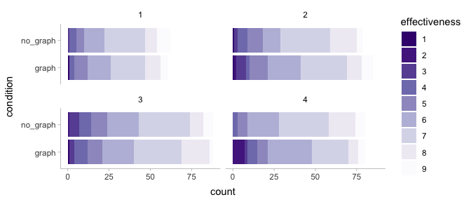<!-- -->

As we can see above, the original dataset contains results from four
different experiments. For the purposes of this lecture, we will confine
ourselves to the first experiment.

``` r
exp1.data = dataset %>%
  filter(experiment == 1)

head(exp1.data)
```

## Model 1. Wilcoxon signed rank test

This is a non-parametric test which we will skip for now. Although,
there exists Bayesian non-parametric methods, they are more advanced for
this lecture.

## Model 2. Bayesian t-test

This is the linear model equivalent for the paired sample t-test.

``` r
dataset1.lm.freqt <-
  lm(
    effectiveness ~ condition - 1, # we remove intercept, which is equivalent 
    data = exp1.data
  )
```

### Step 1: Build the model (likelihood)

Although we know that we are going to use a t distribution, we still
plot the data to set how it looks like. Usually, this will help us
decide our likelihood function.

``` r
exp1.data %>%
  ggplot(., aes(x = effectiveness)) +
  geom_histogram(fill = '#351c75',
                 color = NA,
                 binwidth = .5)
```

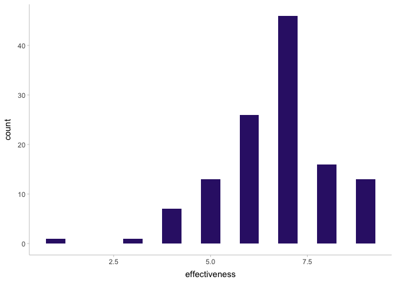<!-- -->
Then we write the formula using brm formula (`bf`) function.

``` r
dataset1.brm.bayesiant.formula <- bf(effectiveness ~ condition - 1,
                                     family = student())
```

### Step 1: Build the model (priors)

We check the priors that we should set

The blank ones are flat (uniform) priors. These are improper priors and
usually needed to be set. We can and should adjust other priors given by
`brm`.

``` r
as_tibble(get_prior(dataset1.brm.bayesiant.formula, data = exp1.data))
```

Our priors.

``` r
dataset1.brm.bayesiant.priors = c(
  # there's a lot of data so even fairly "strong" priors are going to not matter so much here
  prior(normal(0, 1), class = "b"),
  prior(student_t(3, 0, 1), class = "sigma"))
```

### Step 1: Build the model (prior predictive checks)

We do a prior predictive checks to see the predicted range if we only
use priors. This helps us understand the predicted range of priors and
formula, and also helps us understand if our priors and formula are
appropriate.

Actually, the predicted range is quite wide for this model. We could
consider shrink priors.

``` r
dataset1.brm.bayesiant.priorchecks <-
  brm(
    dataset1.brm.bayesiant.formula,
    prior = dataset1.brm.bayesiant.priors,
    data = exp1.data,
    backend = "cmdstanr",
    sample_prior = "only",
    file = "02-bayesian_stats/rds/dataset1.brm.bayesiant.priorchecks.rds"
  )


dataset1.bayesiant.yprior <-
  posterior_predict(dataset1.brm.bayesiant.priorchecks)

ggplot() +
  geom_density(
    aes(x = dataset1.bayesiant.yprior),
    color = '#351c75',
    alpha = .5,
    size = 1
  ) +
  xlab('prior draws')
```

<!-- -->

### Step 2: Computing the posterior probability

``` r
dataset1.brm.bayesiant =
  brm(
    dataset1.brm.bayesiant.formula,
    prior = dataset1.brm.bayesiant.priors,
    data = exp1.data,
    # You may not need this if rstan works with your computer.
    backend = "cmdstanr",
    # There are many other parameters you can play with.
    # Here we use default parameters to simplify the lecture.
    # We save the model 
    # But if you have this file, brm only loads the model for this file
    file = "02-bayesian_stats/rds/dataset1.brm.bayesiant.rds"
  )
```

### Step 3: Evaluate the fit

``` r
summary(dataset1.brm.bayesiant)
```

    ##  Family: student 
    ##   Links: mu = identity; sigma = identity; nu = identity 
    ## Formula: effectiveness ~ condition 
    ##    Data: exp1.data (Number of observations: 123) 
    ## Samples: 4 chains, each with iter = 2000; warmup = 1000; thin = 1;
    ##          total post-warmup samples = 4000
    ## 
    ## Population-Level Effects: 
    ##                   Estimate Est.Error l-95% CI u-95% CI Rhat Bulk_ESS Tail_ESS
    ## Intercept             6.63      0.18     6.28     6.97 1.00     3934     2469
    ## conditionno_graph     0.15      0.24    -0.31     0.63 1.00     3929     2920
    ## 
    ## Family Specific Parameters: 
    ##       Estimate Est.Error l-95% CI u-95% CI Rhat Bulk_ESS Tail_ESS
    ## sigma     1.29      0.12     1.05     1.52 1.00     2543     2387
    ## nu       16.63     11.78     4.16    46.91 1.00     2673     2496
    ## 
    ## Samples were drawn using sample(hmc). For each parameter, Bulk_ESS
    ## and Tail_ESS are effective sample size measures, and Rhat is the potential
    ## scale reduction factor on split chains (at convergence, Rhat = 1).

### Step 3: Evaluate posterior predictions

We then call `bayesplot` to draw posterior distributions and MCMC traces
for each parameter.

We should see that the four chairs are mixed well, meaning that the
model converged.

``` r
color_scheme_set(scheme = "purple")
plot(dataset1.brm.bayesiant)
```

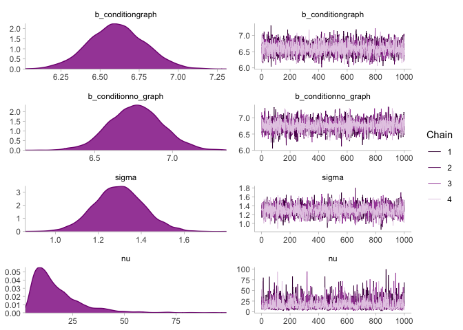<!-- -->

### Step 3: Evaluate posterior predictions

We draw from posterior predictive distributions. They are many ways you
can do this. Here we use posterior_predict from `brms`.

``` r
dataset1.bayesiant.y <- exp1.data$effectiveness
dataset1.bayesiant.yrep <-
  posterior_predict(dataset1.brm.bayesiant)

head(as_tibble(dataset1.bayesiant.yrep[, 1:11]))         
```

We use bayesplot to plot the first eight draws of posterior predictions
and the original data. Again, there are many ways to do this (more in
Lecture 3).

``` r
ppc_hist(y = dataset1.bayesiant.y,
         yrep = dataset1.bayesiant.yrep[1:8,],
         binwidth = .5)
```

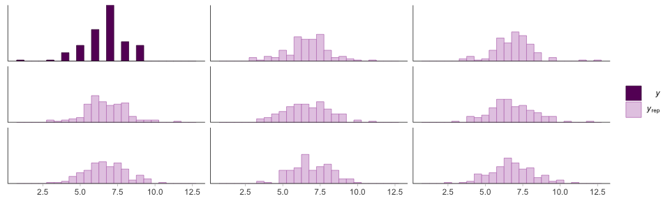<!-- -->

``` r
ppc_dens_overlay(y = dataset1.bayesiant.y,
                 yrep = dataset1.bayesiant.yrep[1:30,])
```

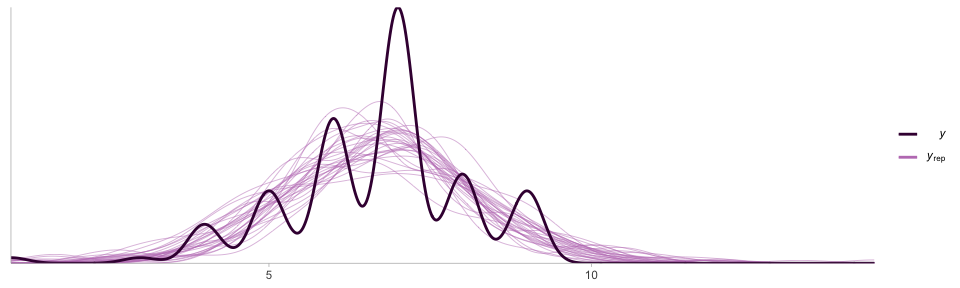<!-- -->

``` r
ppc_stat_grouped(y = dataset1.bayesiant.y,
                 yrep = dataset1.bayesiant.yrep,
                 group = exp1.data$condition)
```

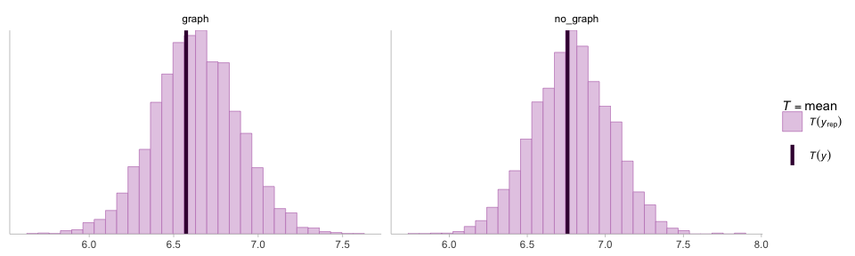<!-- -->

### Step 3: Compare posterior predictions

We compare the two conditions using conditional distributions.
add_epred_draws from tidybayes is the most convenient way…

``` r
dataset1.bayesiant.posterior_epred <-
  tibble(condition = c('graph', 'no_graph')) %>%
  add_epred_draws(dataset1.brm.bayesiant,
                  re_formula = NA,
                  allow_new_levels = FALSE) %>%
  ungroup()

kable(head(dataset1.bayesiant.posterior_epred))
```

| condition | .row | .chain | .iteration | .draw |  .epred |
|:----------|-----:|-------:|-----------:|------:|--------:|
| graph     |    1 |     NA |         NA |     1 | 6.55796 |
| graph     |    1 |     NA |         NA |     2 | 6.77053 |
| graph     |    1 |     NA |         NA |     3 | 6.61823 |
| graph     |    1 |     NA |         NA |     4 | 6.61574 |
| graph     |    1 |     NA |         NA |     5 | 6.35145 |
| graph     |    1 |     NA |         NA |     6 | 6.46093 |

We then transform the data, subtract the two conditions from each other,
and calculate the credible intervals.

``` r
dataset1.bayesiant.posterior_comparison <-
  dataset1.bayesiant.posterior_epred %>%
  select(-c(.chain, .iteration, .row)) %>%
  compare_levels(variable = .epred, by = condition)

# just use head(dataset1.bayesiant.posterior_comparison) if you don't need to knit n html
head(dataset1.bayesiant.posterior_comparison)


dataset1.bayesiant.posterior_comparison %>%
        mean_qi(.epred)
```

We can also plot the credible interval. Lecture 3 will cover more.

``` r
dataset1.bayesiant.posterior_comparison %>%
  median_qi(.epred) %>%
  ggplot() +
  geom_point(aes(x = .epred, y = condition), color = DARK_PURPLE, size = 3) +
  geom_errorbarh(
    aes(xmin = .lower, xmax = .upper, y = condition),
    color = DARK_PURPLE,
    alpha = .5,
    size = 2,
    height = 0
  ) +
  geom_vline(aes(xintercept = 0), linetype = "dashed", color = "gray") +
  coord_cartesian(ylim = c(0, 2), xlim = c(-1, 1))  +
  xlab('') + ylab('')
```

<!-- -->

### Compared to the frequentist estimates

``` r
bind_rows(tidy.wrapper(dataset1.lm.freqt),
          tidy.wrapper(dataset1.brm.bayesiant)) %>%
  ggplot() +
  geom_pointrange(
    aes(
      x = model,
      y = estimate,
      ymin = conf.low,
      ymax = conf.high,
      color = term
    ),
    position = position_dodge(width = 0.2)
  ) +
  scale_color_brewer(palette = "Set1") +
  ylab('effectiveness') +
  scale_y_continuous(breaks = 1:9, limits = c(1, 9)) +
  coord_flip()
```

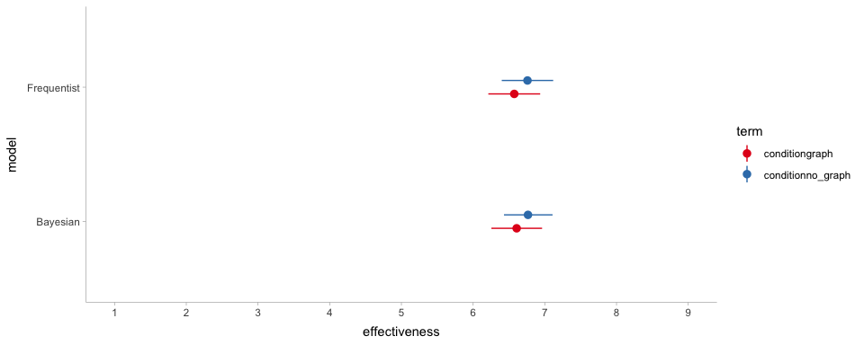<!-- -->

## Model 3. Ordinal Logistic Regression

A more appropriate to analyze ordianl data is to use ordinal logistic
regression. In this section, we reanalyze the data using Bayesian rdinal
logistic regression.

### Step 1: Build the model (likelihood)

``` r
dataset1.brm.olr.formula <-
  bf(effectiveness ~ condition,
     family = cumulative("logit"))
```

### Step 1: Build the model (priors)

``` r
as_tibble(get_prior(dataset1.brm.olr.formula, data = exp1.data))

dataset1.brm.olr.priors = c(prior(normal(0, 1), class = "b"),
                            prior(student_t(3, 0, 1), class = "Intercept"))
```

### Step 1: Build the model (prior predictive checks)

TODO We need to fix this..

``` r
dataset1.brm.olr.priorchecks <- brm(
    effectiveness ~ condition,
    prior = dataset1.brm.olr.priors,
    data = exp1.data,
    family= cumulative("logit"),
    backend = 'cmdstanr',
    sample_prior = 'only',
    file = "02-bayesian_stats/rds/dataset1.brm.bayesiant.priorchecks.rds"
    )


dataset1.olr.yprior <-
  posterior_predict(dataset1.brm.olr.priorchecks)


ggplot() +
  geom_histogram(aes(x = dataset1.olr.yprior),
               fill = '#351c75',
               alpha = .5,
               size = 1,
               binwidth = .5) +
  scale_x_continuous(breaks = 1:9, limits = c(1,9)) + 
  xlab('prior draws') + ylab('')
```

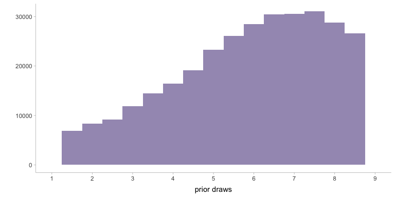<!-- -->

### Step 2: Computing the posterior probability

``` r
dataset1.brm.olr1 =
  brm(
    dataset1.brm.olr.formula,
    prior = dataset1.brm.olr.priors,
    data = exp1.data,
    backend = "cmdstanr",
    file = "02-bayesian_stats/rds/dataset1.brm.olr1.rds"
  )

summary(dataset1.brm.olr1)
```

    ##  Family: cumulative 
    ##   Links: mu = logit; disc = identity 
    ## Formula: effectiveness ~ condition 
    ##    Data: exp1.data (Number of observations: 123) 
    ## Samples: 4 chains, each with iter = 2000; warmup = 1000; thin = 1;
    ##          total post-warmup samples = 4000
    ## 
    ## Population-Level Effects: 
    ##                   Estimate Est.Error l-95% CI u-95% CI Rhat Bulk_ESS Tail_ESS
    ## Intercept[1]         -4.56      0.96    -6.78    -2.99 1.00     1070      513
    ## Intercept[2]         -3.99      0.78    -5.82    -2.71 1.00     1583     1198
    ## Intercept[3]         -3.29      0.56    -4.55    -2.32 1.00     2496     2468
    ## Intercept[4]         -2.14      0.34    -2.85    -1.50 1.00     3348     3016
    ## Intercept[5]         -1.26      0.26    -1.79    -0.76 1.00     3758     3330
    ## Intercept[6]         -0.27      0.23    -0.74     0.18 1.00     3652     3366
    ## Intercept[7]          1.26      0.26     0.77     1.81 1.00     3532     3334
    ## Intercept[8]          2.22      0.33     1.62     2.91 1.00     3937     2992
    ## conditionno_graph     0.18      0.31    -0.40     0.81 1.00     3434     2673
    ## 
    ## Family Specific Parameters: 
    ##      Estimate Est.Error l-95% CI u-95% CI Rhat Bulk_ESS Tail_ESS
    ## disc     1.00      0.00     1.00     1.00 1.00     4000     4000
    ## 
    ## Samples were drawn using sample(hmc). For each parameter, Bulk_ESS
    ## and Tail_ESS are effective sample size measures, and Rhat is the potential
    ## scale reduction factor on split chains (at convergence, Rhat = 1).

We see the error messages. Here we adjust a few sampling parameters to
help the model converge.

``` r
dataset1.brm.olr2 =
  brm(
    dataset1.brm.olr.formula,
    prior = dataset1.brm.olr.priors,
    data = exp1.data,
    backend = "cmdstanr",
    warmup = 1500,
    iter = 2500,
    control = list(adapt_delta = 0.99, max_treedepth = 15),
    file = "02-bayesian_stats/rds/dataset1.brm.olr2.rds"
  )

summary(dataset1.brm.olr2)
```

    ##  Family: cumulative 
    ##   Links: mu = logit; disc = identity 
    ## Formula: effectiveness ~ condition 
    ##    Data: exp1.data (Number of observations: 123) 
    ## Samples: 4 chains, each with iter = 2500; warmup = 1500; thin = 1;
    ##          total post-warmup samples = 4000
    ## 
    ## Population-Level Effects: 
    ##                   Estimate Est.Error l-95% CI u-95% CI Rhat Bulk_ESS Tail_ESS
    ## Intercept[1]         -4.58      1.00    -6.88    -3.00 1.00     2194     1948
    ## Intercept[2]         -3.99      0.78    -5.76    -2.71 1.00     2806     2384
    ## Intercept[3]         -3.30      0.55    -4.48    -2.32 1.00     3705     2806
    ## Intercept[4]         -2.15      0.34    -2.85    -1.51 1.00     4378     3270
    ## Intercept[5]         -1.26      0.26    -1.78    -0.76 1.00     4525     3093
    ## Intercept[6]         -0.27      0.24    -0.73     0.19 1.00     3935     3132
    ## Intercept[7]          1.27      0.26     0.76     1.79 1.00     4089     3216
    ## Intercept[8]          2.23      0.34     1.58     2.92 1.00     4890     3122
    ## conditionno_graph     0.19      0.31    -0.43     0.82 1.00     4856     2853
    ## 
    ## Family Specific Parameters: 
    ##      Estimate Est.Error l-95% CI u-95% CI Rhat Bulk_ESS Tail_ESS
    ## disc     1.00      0.00     1.00     1.00 1.00     4000     4000
    ## 
    ## Samples were drawn using sample(hmc). For each parameter, Bulk_ESS
    ## and Tail_ESS are effective sample size measures, and Rhat is the potential
    ## scale reduction factor on split chains (at convergence, Rhat = 1).

### Step 3: Evaluate the fit (MCMC traces)

``` r
plot(dataset1.brm.olr2)
```

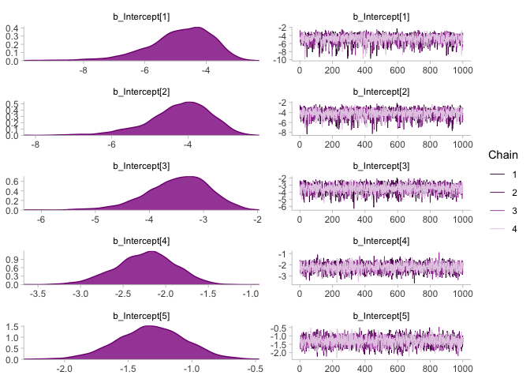<!-- -->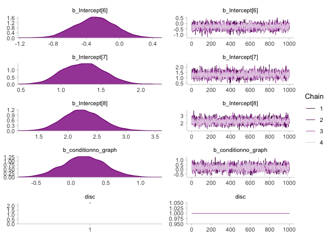<!-- -->

### Step 3: Evaluate posterior predictions

``` r
dataset1.olr.y <- exp1.data$effectiveness
dataset1.olr.yrep <- posterior_predict(dataset1.brm.olr2)

ppc_hist(y = dataset1.olr.y,
         yrep = dataset1.olr.yrep[1000:1007, ],
         binwidth = .5)
```

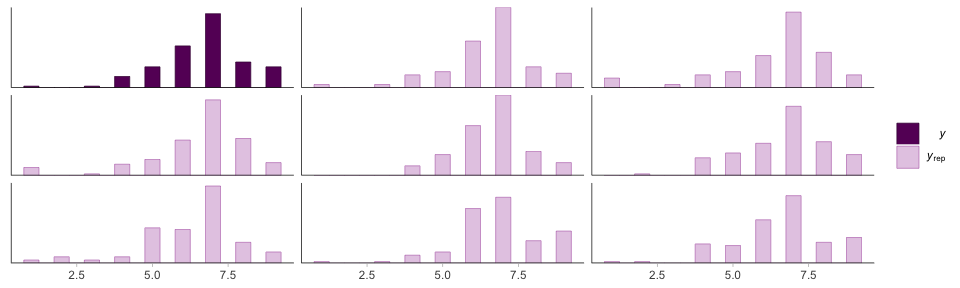<!-- -->

``` r
ppc_dens_overlay(y = dataset1.olr.y,
                 yrep = dataset1.olr.yrep[2000:2030, ])
```

<!-- -->

``` r
ppc_stat_grouped(y = dataset1.olr.y,
                 yrep = dataset1.olr.yrep,
                 group = exp1.data$condition)
```

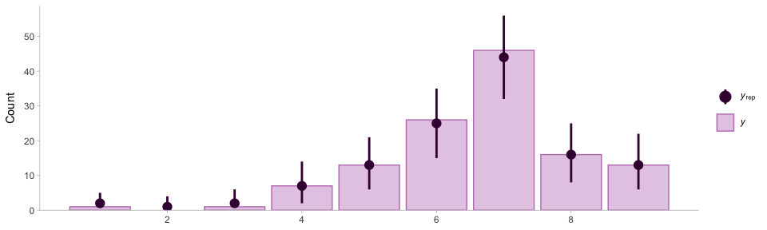<!-- -->
\### Step 3: Compare posterior predictions

``` r
dataset1.olr.posterior_epred <-
  tibble(condition = c('graph', 'no_graph')) %>%
  add_epred_draws(dataset1.brm.olr2,
                  re_formula = NA,
                  allow_new_levels = FALSE) %>%
  ungroup()

head(dataset1.olr.posterior_epred)

dataset1.olr.posterior_comparison <-
  dataset1.olr.posterior_epred %>%
  select(-c(.chain, .iteration, .row)) %>%
  group_by(.category) %>%
  compare_levels(variable = .epred, by = condition)

head(dataset1.olr.posterior_comparison %>%
       mean_qi())
```

``` r
dataset1.olr.posterior_comparison %>%
  mean_qi(.epred) %>%
  ggplot() +
  geom_point(aes(y = .epred, x = .category), size = 3, color = DARK_PURPLE) +
  geom_errorbar(
    aes(ymin = .lower, ymax = .upper, x = .category),
    width = 0,
    size = 2,
    color = DARK_PURPLE,
    alpha = .5
  ) +
  geom_hline(aes(yintercept = 0), linetype = "dashed", color = "gray") +
  xlab('') + ylab('no_graph - graph') +
  theme(axis.title.y = element_text(angle = 0, vjust = .5))
```

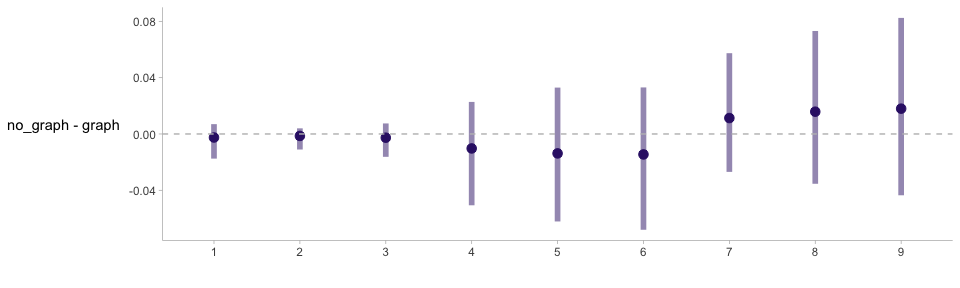<!-- -->

# Dataset 2

Load the data.

``` r
dataset2 = readr::read_csv("02-bayesian_stats/data/exp2.csv") %>%
  mutate(condition = condition == 'expansive') %>%
  group_by(participant)

head(dataset2)
```

We plot the data to give us a better picture about its distribution.

``` r
dataset2 %>%
  mutate(c = as.factor(condition)) %>%
  ggplot(aes(x = change)) +
  geom_histogram(
    aes(y = ..density..),
    binwidth = 6,
    fill = DARK_PURPLE,
    color = 'white'
  ) +
  geom_density(size = 1,
               adjust = 1.5,
               color = 'lightgray') +
  scale_x_continuous(limits = c(-200, 200)) 
```

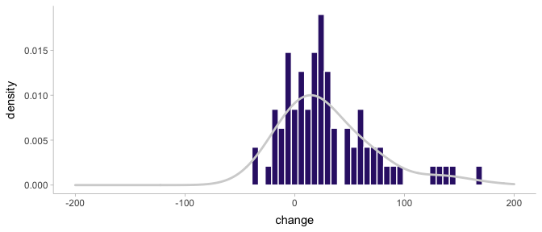<!-- -->

### Step 1: Build the model (likelihood and priors)

This model is the BEST test model as described by Kruschke in the paper
*Bayesian estimation supersedes the t-test*. In this model, *β*
indicates the mean difference in the outcome variable between the two
groups (in this case, the percent change in the BART scores). We fit
different priors on *β* and set different weights on these priors to
obtain our posterior estimate.

$$
\\begin{align}
y\_{i} &\\sim \\mathrm{T}(\\nu, \\mu, \\sigma) \\\\
\\mu &= \\alpha\_{0} + \\beta \* x_i \\\\
\\sigma &= \\sigma\_{a} + \\sigma\_{b}\*x_i \\\\
\\beta &\\sim \\mathrm{N}(\\mu\_{0}, \\sigma\_{0}) \\\\
\\sigma_a, \\sigma_b &\\sim \\mathrm{Cauchy}(0, 2) \\\\
\\nu &\\sim \\mathrm{exp}(1/30)
\\end{align}
$$

We translate the above specification to R code.

``` r
dataset2.brm.student.formula <- bf(change ~ condition,
                                   sigma ~ condition,
                                   family = student())

head(as_tibble(get_prior(dataset2.brm.student.formula, data = dataset2)))
```

``` r
dataset2.brm.student.priorchecks = brm(
  dataset2.brm.student.formula,
  prior = c(
    prior(normal(0, 2), class = "b"),
    prior(cauchy(0, 2), class = "b", dpar = "sigma"),
    prior(exponential(0.033), class = "nu"),
    prior(student_t(3, 0, 5), class = "Intercept"),
    prior(student_t(3, 0, 2), class = "Intercept", dpar = "sigma")
  ),
  data = dataset2,
  backend = "cmdstanr",
  sample_prior = 'only',
  file = "02-bayesian_stats/rds/dataset2.brm.student.priorchecks.rds"
)
# This breaks :-)
# dataset2.student.yprior <-
#   posterior_predict(dataset2.brm.student.priorchecks)

# ggplot() +
#   geom_density(
#     aes(x = dataset2.student.yprior),
#     color = '#351c75',
#     alpha = .5,
#     size = 1
#   ) +
#   xlab('prior draws') +
#   ggtitle('prior preditive check')
```

### Step 2: Computing the posterior probability

``` r
dataset2.brm.student = brm(
 bf(change ~ condition, 
 sigma ~ condition,
 family = student()),
 prior = c(
   prior(normal(0, 2), class = "b"),
   prior(cauchy(0, 2), class = "b", dpar = "sigma"),
   prior(exponential(.033), class = "nu"),
   prior(student_t(3, 0, 5), class = "Intercept"),
   prior(student_t(3, 0, 2), class = "Intercept", dpar = "sigma")
 ), 
 data = dataset2,
 backend = "cmdstanr",
 file = "02-bayesian_stats/rds/dataset2.brm.student.rds"
)

dataset2.brm.student$prior
```

    ##               prior     class          coef group resp
    ##        normal(0, 2)         b                         
    ##        normal(0, 2)         b conditionTRUE           
    ##        cauchy(0, 2)         b                         
    ##        cauchy(0, 2)         b conditionTRUE           
    ##  student_t(3, 0, 5) Intercept                         
    ##  student_t(3, 0, 2) Intercept                         
    ##  exponential(0.033)        nu                         
    ##   dpar nlpar bound       source
    ##                            user
    ##                    (vectorized)
    ##  sigma                     user
    ##  sigma             (vectorized)
    ##                            user
    ##  sigma                     user
    ##                            user

### Step 3: Evaluate the fit (summary)

``` r
summary(dataset2.brm.student)
```

    ##  Family: student 
    ##   Links: mu = identity; sigma = log; nu = identity 
    ## Formula: change ~ condition 
    ##          sigma ~ condition
    ##    Data: dataset2 (Number of observations: 80) 
    ## Samples: 4 chains, each with iter = 2000; warmup = 1000; thin = 1;
    ##          total post-warmup samples = 4000
    ## 
    ## Population-Level Effects: 
    ##                     Estimate Est.Error l-95% CI u-95% CI
    ## Intercept              21.15      4.95    11.41    31.04
    ## sigma_Intercept         3.37      0.20     2.98     3.76
    ## conditionTRUE          -0.15      1.92    -4.01     3.46
    ## sigma_conditionTRUE     0.14      0.22    -0.31     0.55
    ##                     Rhat Bulk_ESS Tail_ESS
    ## Intercept           1.00     2751     2071
    ## sigma_Intercept     1.00     2331     2293
    ## conditionTRUE       1.00     3711     2961
    ## sigma_conditionTRUE 1.00     3648     2440
    ## 
    ## Family Specific Parameters: 
    ##    Estimate Est.Error l-95% CI u-95% CI Rhat Bulk_ESS
    ## nu     4.87      5.87     1.59    16.82 1.00     1781
    ##    Tail_ESS
    ## nu     1303
    ## 
    ## Samples were drawn using sample(hmc). For each parameter, Bulk_ESS
    ## and Tail_ESS are effective sample size measures, and Rhat is the potential
    ## scale reduction factor on split chains (at convergence, Rhat = 1).

### Step 3: Evaluate the posterior predictions

``` r
plot(dataset2.brm.student)
```

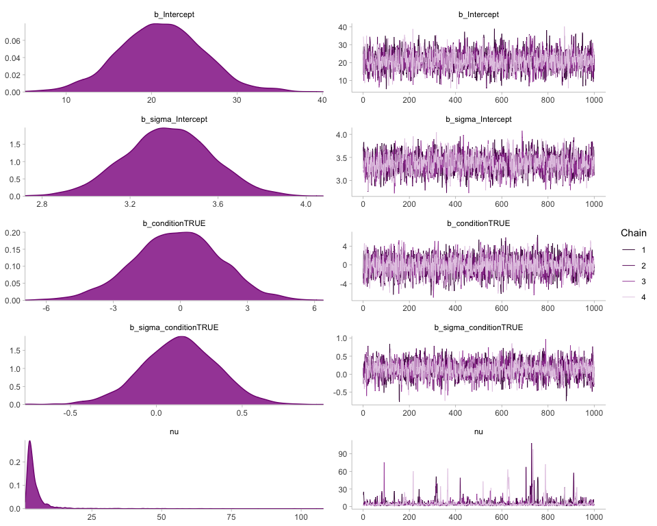<!-- -->

``` r
dataset2.student.y <- dataset2.brm.student$data$change
dataset2.student.yrep <- posterior_predict(dataset2.brm.student)

dataset2.student.epred <- tibble(condition = c(TRUE, FALSE)) %>%
  add_epred_draws(dataset2.brm.student,
                  re_formula = NA,
                  allow_new_levels = TRUE) %>%
  ungroup()
```

``` r
ppc_hist(y = dataset2.student.y,
         yrep = dataset2.student.yrep[100:107, ],
         binwidth = 10)
```

<!-- -->

``` r
ppc_dens_overlay(y = dataset2.student.y,
                 yrep = dataset2.student.yrep[2000:2030, ])
```

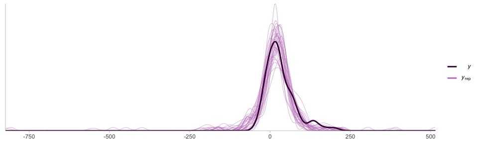<!-- -->

``` r
ppc_stat_grouped(
  y = dataset2.student.y,
  yrep = dataset2.student.yrep,
  group = dataset2$condition,
  binwidth = 5
)
```

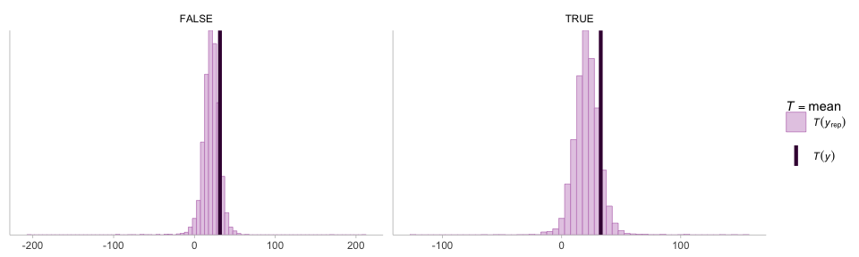<!-- -->

### Step 3: Compare the posterior predictions

``` r
dataset2.student.epred_comparison <-
  tibble(condition = c(TRUE, FALSE)) %>%
  add_epred_draws(dataset2.brm.student,
                  re_formula = NA,
                  allow_new_levels = FALSE) %>%
  ungroup() %>%
  select(-c(.chain, .iteration, .row)) %>%
  compare_levels(variable = .epred, by = condition) %>%
  rename(diff = .epred)


kable(head(dataset2.student.epred_comparison))
```

| .draw | condition    |      diff |
|------:|:-------------|----------:|
|     1 | TRUE - FALSE | -2.918310 |
|     2 | TRUE - FALSE |  2.367050 |
|     3 | TRUE - FALSE |  3.045840 |
|     4 | TRUE - FALSE | -0.455904 |
|     5 | TRUE - FALSE | -1.398820 |
|     6 | TRUE - FALSE |  2.193080 |

``` r
dataset2.student.epred_comparison %>%
  select(diff) %>%
  mean_qi() %>%
  ggplot() +
  geom_point(aes(x = diff, y = condition), size = 3, color = DARK_PURPLE) +
  geom_errorbarh(
    aes(xmin = .lower, xmax = .upper, y = condition),
    height = 0,
    color = DARK_PURPLE,
    alpha = .5,
    size = 2
  ) +
  geom_vline(aes(xintercept = 0), linetype = "dashed", color = "gray") +
  coord_cartesian(ylim = c(0, 2), xlim = c(-5, 5))  +
  scale_y_discrete(label = c('expansive - not expansive')) +
  xlab('')  + ylab('')
```

<!-- -->

<!-- # Model 2 -->
<!-- Fumeng: I'm confused... It seems that Abhraneel has to generate some data in order to do poisson regression. -->
<!-- I would say we use the generated data from Dataset 2 or remove this...  -->
<!-- ```{r} -->
<!-- sim_trial = function(y) { -->
<!--   # let y be the actual number of trials that a participant will pump until -->
<!--   # p be the point of explosion for any given trial -->
<!--   p = sample(1:128, 1) -->
<!--   ifelse(p < y, p, y) -->
<!-- } -->
<!-- sim_exp = function(i, N = 10) { -->
<!--   trials = 1:N -->
<!--   map_dbl(trials, ~ sim_trial(i)) -->
<!-- } -->
<!-- sim_ = function(x, iter = 1e3) { -->
<!--   # here x is the averahe number of pumps by a participant -->
<!--   # we can perform a naive grid search approach -->
<!--   # let y >= x -->
<!--   for (i in ceiling(x):128) { -->
<!--     pumps = map( -->
<!--       1:iter,  -->
<!--       ~ mean(sim_exp(i)) # simulates one experiment and calculates the average number of pumps for that experiment -->
<!--     ) # repeats the simulation many times -->
<!--     if ((mean(map_dbl(pumps, mean))) > x) { -->
<!--       return(i) -->
<!--     } -->
<!--   } -->
<!-- } -->
<!-- ``` -->
<!-- ```{r, eval = FALSE} -->
<!-- df.gen = df %>% -->
<!--   mutate( -->
<!--     P10 = map(adjP10, sim_), -->
<!--     P20 = map(adjP20, sim_), -->
<!--     P30 = map(adjP30, sim_) -->
<!--   ) -->
<!-- saveRDS(df.gen, "~/Documents/Github/chi22-course/data/exp2-gen.rds") -->
<!-- ``` -->
<!-- ```{r} -->
<!-- df.gen = readRDS("~/Documents/Github/chi22-course/data/exp2-gen.rds") %>% -->
<!--   mutate( -->
<!--     P10 = map(P10, ~ unlist(ifelse(is.numeric(.), P10, 128))), -->
<!--     P20 = map(P20, ~ unlist(ifelse(is.numeric(.), P20, 128))), -->
<!--     P30 = map(P30, ~ unlist(ifelse(is.numeric(.), P30, 128))) -->
<!--   ) %>% -->
<!--   mutate( -->
<!--     trial_P10 = map(P10, ~ (sim_exp(.))), -->
<!--     trial_P20 = map(P20, ~ (sim_exp(.))), -->
<!--     trial_P30 = map(P30, ~ (sim_exp(.))) -->
<!--   ) %>% -->
<!--   pivot_longer( -->
<!--     cols = starts_with("trial"), -->
<!--     names_to = "trial", -->
<!--     names_prefix = "trial_P" -->
<!--   ) %>% -->
<!--   unnest(c(value)) %>% -->
<!--   group_by(participant) %>% -->
<!--   mutate(trial = row_number()) %>% -->
<!--   select(-c(starts_with("adjP"), "P10", "P20", "P30", "change", "orig")) -->
<!-- ``` -->
<!-- ```{r} -->
<!-- # poisson analysis -->
<!-- fit.poiss = brm( -->
<!--   bf(value ~ condition),  -->
<!--   prior = c(prior(normal(0, 1), class = "b"), prior(student_t(3, 3.5, 1), class = "Intercept")),  -->
<!--   data = df.gen, family = poisson(),  -->
<!--   chains = 4, cores = 4) -->
<!-- ``` -->
