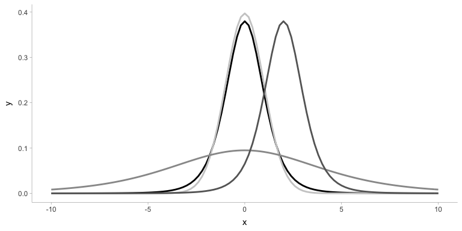
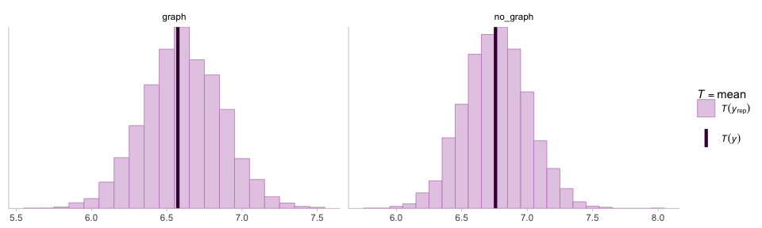
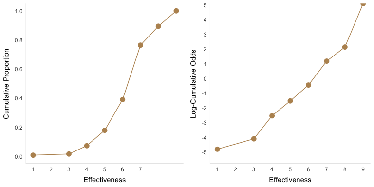
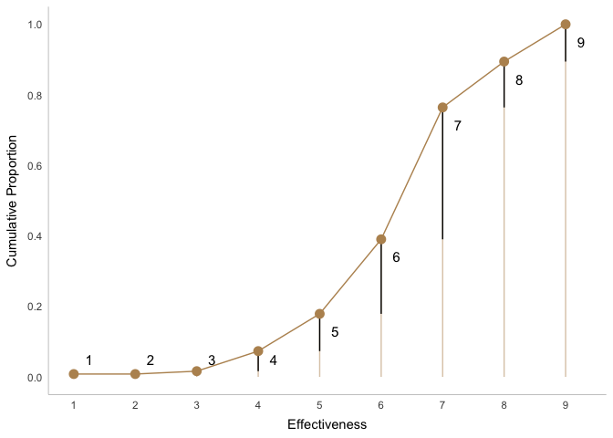
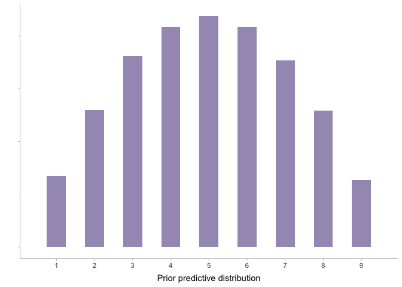
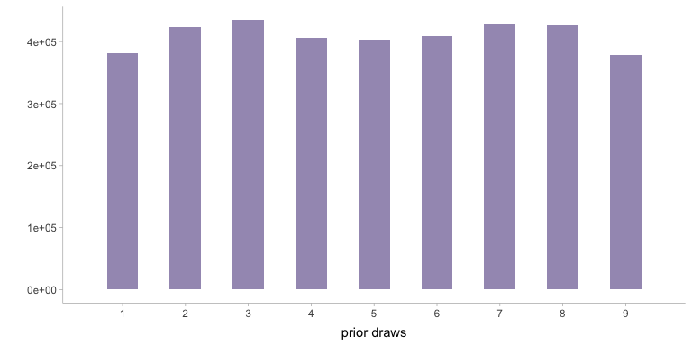
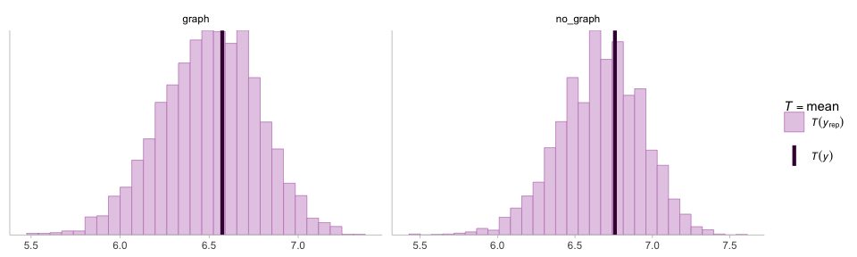

<style>
.sourceCode.r{
  background-color:#f7f8f9ff;
  font-family: Courier New;
  font-weight: bold
}

</style>

# Introduction

In this document, we will outline the Bayesian analogs of the
statistical analyses described
[here](https://github.com/chatchavan/CHI-Course-Transparent-Quant/blob/master/frequentist.Rmd)
(and in the previous course lecture).

Helper functions. This function extracts results from different models
and generate results of the same format to be used in visualizations

``` r
tidy.wrapper = function(model) {
  if (class(model) == "lm") {
    tidy(model, conf.int = TRUE) %>%
      select(-c(statistic, p.value)) %>%
      mutate(model = "Frequentist") %>%
      select(model, everything())
  } else if (class(model) == "brmsfit") {
    tidy(model) %>%
      filter(effect == "fixed") %>%
      select(c(term:conf.high)) %>%
      mutate(model = "Bayesian") %>%
      select(model, everything())
  } else {
    stop("unknown model class")
  }
}
```

# Dataset 1

Let’s first load and take a look at the data in a table:

``` r
dataset = readr::read_csv("blinded.csv")

head(dataset)
```

Recall from the previous lecture that this dataset contains results from
four experiments. In each experiment, participants are placed in either
a *graph* or *no graph* condition, and asked to rate the effectiveness
of the intervention on a nine-item Likert scale. Here, we plot the data
to show the distribution of these responses:

``` r
dataset %>% 
  mutate(effectiveness = fct_rev(factor(effectiveness, levels = 1:9)),
         experiment = as.factor(experiment)) %>%
  
  # stacked bar plot
  ggplot(aes(x = condition, fill = effectiveness)) +
  geom_bar(position = "stack", stat="count") +
  
  # plot data for different experiments as small multiples
  facet_wrap(. ~ experiment) +
  
  # grey color scale is robust for colorblind
  scale_fill_brewer(palette="Purples", drop = FALSE) +
  
  # horizontal plot
  coord_flip() +
  
  # legend
  guides(fill = guide_legend(reverse = TRUE)) 
```

<!-- -->

For the purposes of this lecture, we will confine ourselves to the first
experiment.

``` r
exp1.data = dataset %>%
  filter(experiment == 1)

head(exp1.data)
```

## Model 1. Wilcoxon signed rank test

The first model discussed in the previous lecture was the
`Wilcoxon signed rank test`. This is a non-parametric test which we will
skip for now. Although, there exists Bayesian non-parametric methods,
they are more advanced for this lecture.

## Model 2. Students’s t test

The second model discussed was the T-test. Although R contains a
function (`t.test`) to perform this analysis, the t-test is essentially
a linear regression, and thus can be performed using the linear model
function in R (`lm`). This is the linear model equivalent for the paired
sample t-test:

### Frequentist t-test

``` r
dataset1.lm.freqt <-
  lm(
    effectiveness ~ condition - 1, # we remove intercept
    data = exp1.data
  )
```

### Step 1: Build the model (likelihood)

Before we implement a Bayesian model, let us take a look at the
distribution of responses. Although we know that we are going to use a t
distribution, we still plot the data to set how it looks like. Usually,
this will help us decide our likelihood function.

``` r
  exp1.data %>%
     ggplot(., aes(x = effectiveness)) +
  geom_histogram(fill = DARK_PURPLE, color = NA, binwidth = 0.5, center = 0) +
  scale_x_continuous(breaks = seq(0, 10, by = 1))
```

<!-- -->

Let’s also look how a student t distribution varies different parameter.
Mu is location, sigma is dipsersion, and nu (df) control the tail.

``` r
ggplot() +  xlim(-10, 10) + 
  geom_function(color = "black", fun = function(x) dstudent_t(x, mu = 0, sigma = 1, df = 5) , size = 1) + 
  geom_function(color = "gray80", fun = function(x) dstudent_t(x, mu = 0, sigma = 1, df = 50), size = 1) + 
  geom_function(color = "gray60", fun = function(x) dstudent_t(x, mu = 0, sigma = 4, df = 5), size = 1) + 
  geom_function(color = "gray40", fun = function(x) dstudent_t(x, mu = 2,  sigma = 1, df = 5), size = 1) +
  xlab("x")
```

<!-- --> We
can see from the above plot that the responses are discrete. This is
important to keep in mind when specifying a Bayesian model. Next, we
will implement the Bayesian analog of the linear model described
earlier. Here’s what the model formula will look like when implemented
using the `brm` formula (`bf` function):

``` r
dataset1.brm.bayesiant.formula <- bf(effectiveness ~ condition - 1,
                                     family = student())
```

Let us take a minute to understand this code. It says that we are
regressing the variable `condition` on `effectiveness`. The `- 1`
removes the intercept term. The family argument is used to specify the
probability distribution of the likelihood — in other words, what is the
distribution of *P*(*y*).

### Step 1: Build the model (priors)

The blank ones are flat (uniform) priors. These are improper priors and
usually needed to be set. We can and should adjust other priors given by
`brm`.

``` r
as_tibble(get_prior(dataset1.brm.bayesiant.formula, data = exp1.data))
```

Next, we need to specify priors for the parameters in the model. We will
discuss briefly how these prior distributions were obtained.

For the prior on `b` which is the mean parameter of the student t
distribution (used as the likelihood), a unbiased assumption would be
that they should be centered around 5 (which is the center of the 9-item
likert scale), and the mean would likely be greater than 1 and less than
9 (unless every single participant responded either 1 or 9; but we know
that was not the case).

The prior on `sigma` determines the standard deviation parameter of the
student t distribution. Now, considering that our data is bounded
between 1 and 9, a uniform distribution will have the maximum variance
given these constraints. The variance of such an uniform distribution
would be: `sd(runif(1e4, 1, 9)` which is approximately 2.5. We know that
our data will most likely have less variance than such a uniform
distribution. Thus, we want the prior on `sigma` to assign very little
probability mass for values greater than 2.5. Our prior
`student_t(3, 0, 1)` assigns less than 0.05 probability to values
greater than 2.5 (you can check by running the following code in the
console: `sum(gamlss.dist::rTF(1e4, 0, 1, 3) > 2.5) / 1e4`).

``` r
dataset1.brm.bayesiant.priors = c(
      prior(normal(5, 1.5), class = "b"),
      prior(student_t(3, 0, 1), class = "sigma")
  )
```

### Step 1: Build the model (prior predictive checks)

Before we implement the regression model, it is advisable to perform
some prior predictive checks. Bayesian models are generative — in other
words, it is possible to sample values from the prior distributions,
feed them through the likelihood function to obtain a *prior predictive*
distribution.

The prior predictive distribution should ideally resemble the data
generating process, and should not assign probability mass to unlikely
or impossible values. If the prior predictive distribution is assigning
substantial probability mass to unlikely or impossible values, we should
want to adjust our choice of prior distributions. Prior predictive
checks also help make explicit some of the assumptions that go into the
prior specification process.

Another important thing to note is that `brms` often specifies improper
priors (denoted by `flat`) by default. However, we cannot sample draws
from the prior predictive distribution if the priors are improper.

The following code block implements some prior predictive checks:

``` r
dataset1.brm.bayesiant.priorchecks <-
  brm(
    dataset1.brm.bayesiant.formula,
    prior = dataset1.brm.bayesiant.priors,
    data = exp1.data,
    backend = BRM_BACKEND,
    sample_prior = "only",
    file = "02-bayesian_stats/rds/dataset1.brm.bayesiant.priorchecks.rds"
  )

# extract n = 100 draws from the prior predictive distribution
dataset1.bayesiant.yprior <-
  posterior_predict(dataset1.brm.bayesiant.priorchecks, ndraws = 30)

# the following computes the probability density for each "draw"
dataset1.bayesiant.ppc = dataset1.bayesiant.yprior %>%
  as_tibble() %>%
  mutate(.draw = row_number()) %>%
  pivot_longer(
    cols = starts_with("V"),
    names_to = "participant",
    names_prefix = "V",
    values_to = ".value"
  ) %>%
  group_by(.draw) %>%
  summarise(.value = list(.value)) %>%
  mutate(dens.x = map(.value, ~ density(.)$x),
         dens.y = map(.value, ~ density(.)$y))

dataset1.bayesiant.ppc %>%
  select(-.value) %>%
  unnest(c(dens.x, dens.y)) %>%
  ggplot() +
  geom_line(
    aes(x = dens.x, y = dens.y, group = .draw),
    color = DARK_PURPLE,
    alpha = .1,
    size = .1
  ) +
  labs(y = "", x = 'Draws from the prior predictive distribution')
```

<!-- -->

Although, based on the above plot, it seems like the model is assigning
some non-zero probability to values which are not possible (y \<= 0 and
y \> 9), these are primarily a result of our choice of the likelihood
function — the `student t` distribution does not allow us to set bounds
on the predictive distribution. Another reason for extreme values may be
the use of a student’s t prior for sigma with 3 degrees of freedom —
this distribution has fat tails and thus might result in predicting
large values for the standard deviation parameter in our model.

For now, let’s move forward, and fit the model.

### Step 2: Computing the posterior probability distribution

Next, we compute the posterior probability distribution using `brms` and
`Stan`. Depending on the complexity of your model, this step may take a
lot of time. Our model is not so complex, hence this will not take too
long :)

``` r
dataset1.brm.bayesiant =
  brm(
    dataset1.brm.bayesiant.formula,
    prior = dataset1.brm.bayesiant.priors,
    data = exp1.data,
    backend = BRM_BACKEND,
    # There are many other parameters you can play with.
    # Here we use default parameters to simplify the lecture.
    # We save the model 
    # But if you have this file, brm only loads the model from this file
    file = "02-bayesian_stats/rds/dataset1.brm.bayesiant.rds"
  )
```

### Step 3: Evaluate the fit

After the compilation step of the model is complete, we can evaluate the
fit and examine the result. Similar to `lm()`, the first step is to call
the `summary()` function on the variable which contains the model
compilation result:

``` r
summary(dataset1.brm.bayesiant)
```

    ##  Family: student 
    ##   Links: mu = identity; sigma = identity; nu = identity 
    ## Formula: effectiveness ~ condition - 1 
    ##    Data: exp1.data (Number of observations: 123) 
    ## Samples: 4 chains, each with iter = 2000; warmup = 1000; thin = 1;
    ##          total post-warmup samples = 4000
    ## 
    ## Population-Level Effects: 
    ##                   Estimate Est.Error l-95% CI u-95% CI Rhat Bulk_ESS Tail_ESS
    ## conditiongraph        6.61      0.18     6.25     6.96 1.00     3838     2692
    ## conditionno_graph     6.77      0.17     6.43     7.11 1.00     3210     2355
    ## 
    ## Family Specific Parameters: 
    ##       Estimate Est.Error l-95% CI u-95% CI Rhat Bulk_ESS Tail_ESS
    ## sigma     1.30      0.11     1.07     1.52 1.00     3172     2490
    ## nu       16.84     11.62     4.36    46.74 1.00     3081     2832
    ## 
    ## Samples were drawn using sampling(NUTS). For each parameter, Bulk_ESS
    ## and Tail_ESS are effective sample size measures, and Rhat is the potential
    ## scale reduction factor on split chains (at convergence, Rhat = 1).

This will give us an overview of the coefficients of the various
parameters, along with the 95% credible intervals. This result shows
that there is substantial overlap between the credible intervals for the
two conditions. Before we delve deeper into the results, it is important
to run some diagnostics on the sampling process.

### Step 3: Evaluate posterior predictions

First, we call `bayesplot` to draw posterior distributions and MCMC
traces for each parameter. We want to check whether the four chairs have
mixed well. If they have, this implies that the model has converged.

``` r
color_scheme_set(scheme = "purple")
plot(dataset1.brm.bayesiant, newpage = T)
```

<!-- -->

Next, we need to examine if the posterior distributions computed by our
MCMC process resembles the data. Each draw from the posterior predictive
distribution should roughly resemble a “hypothetical experiment” with
the same experimental design. Thus, if our posterior predictive
distribution looks very different from the data, it implies that
something has gone awry in our model building step (Step 1).

They are many ways you can draw from the posterior predictive
distribution. Here we use `posterior_predict` from `brms`.

``` r
dataset1.bayesiant.y <- exp1.data$effectiveness
dataset1.bayesiant.yrep <-
  posterior_predict(dataset1.brm.bayesiant)

head(as_tibble(dataset1.bayesiant.yrep[, 1:11]))
```

We use `bayesplot` to perform these diagnostic tests. First, we plot the
first eight draws of posterior predictions and the original data. Again,
there are many ways to do this (and these will be discussed in greater
detail in Lecture 3).

``` r
ppc_hist(y = dataset1.bayesiant.y,
         yrep = dataset1.bayesiant.yrep[1:8,],
         binwidth = .5)
```

<!-- -->
An alternative approach would be to plot densities for each *draw* from
the posterior predictive distribution superimposed with the density from
the actual data:

``` r
ppc_dens_overlay(y = dataset1.bayesiant.y,
                 yrep = dataset1.bayesiant.yrep[1:30,])
```

<!-- -->
Finally, we look at whether our model is able to capture the summary
statistics properly. Below we show the distribution of the estimated
posterior mean for the two conditions, as well as the actual mean of the
data in the two conditions. Since the actual mean appears to be centered
around the estimated posterior distribution of the mean, we can conclude
that it is roughly capturing the relevant information from the
experimental data.

``` r
ppc_stat_grouped(y = dataset1.bayesiant.y,
                 yrep = dataset1.bayesiant.yrep,
                 group = exp1.data$condition, binwidth = .1)
```

<!-- -->

### Step 3: Comparing posterior distributions

Now that we have performed model diagnostics, we would like to interpret
the results. The pertinent research question here is whether there is a
difference in the effectiveness rating between the *graph* and *no
graph* condition. We use conditional distributions to compare the mean
difference between the two conditions. `add_epred_draws()` from
tidybayes is the most convenient way.

``` r
dataset1.bayesiant.posterior_epred <-
  tibble(condition = c('graph', 'no_graph')) %>%
  add_epred_draws(dataset1.brm.bayesiant,
                  re_formula = NA,
                  allow_new_levels = FALSE) %>%
  ungroup()

head(dataset1.bayesiant.posterior_epred)
```

Here `add_epred_draws()` takes two arguments:

-   *newdata*: is used to generate predictions. This variable should
    describe the experimental design. In this example, our experimental
    design consists of two conditions, *graph* and *no graph*, which is
    being passed as the first argument.

-   *object*: the model fit object

We then transform the data, subtract the two conditions from each other
(using the `compare_levels()` function), and calculate the credible
intervals (using `mean_qi()`).

``` r
dataset1.bayesiant.posterior_comparison <-
  dataset1.bayesiant.posterior_epred %>%
  select(-c(.chain, .iteration, .row)) %>%
  compare_levels(variable = .epred, by = condition)

head(dataset1.bayesiant.posterior_comparison)

dataset1.bayesiant.posterior_comparison %>%
        mean_qi(.epred)
```

A basic way to interpret and communicate the results is to plot them. We
plot this result using credible interval. Lecture 3 will cover more ways
of representing uncertainty for effective communication.

``` r
dataset1.bayesiant.posterior_comparison %>%
  median_qi(.epred) %>%
  ggplot() +
  geom_point(aes(x = .epred, y = condition), color = DARK_PURPLE, size = 3) +
  geom_errorbarh(
    aes(xmin = .lower, xmax = .upper, y = condition),
    color = DARK_PURPLE,
    alpha = .5,
    size = 2,
    height = 0
  ) +
  geom_vline(aes(xintercept = 0), linetype = "dashed", color = "gray") +
  coord_cartesian(ylim = c(0, 2), xlim = c(-1, 1))  +
  xlab('') + ylab('')
```

<!-- -->

Finally, we compare the results obtained from the Bayesian model to the
frequentist estimates:

``` r
bind_rows(tidy.wrapper(dataset1.lm.freqt),
          tidy.wrapper(dataset1.brm.bayesiant)) %>%
  ggplot() +
  geom_pointrange(
    aes(
      x = model,
      y = estimate,
      ymin = conf.low,
      ymax = conf.high,
      color = term
    ),
    position = position_dodge(width = 0.2)
  ) +
  scale_color_brewer(palette = "Set1") +
  ylab('effectiveness') +
  scale_y_continuous(breaks = 1:9, limits = c(1, 9)) +
  coord_flip()
```

<!-- -->

## Model 3. Ordinal Logistic Regression

A more appropriate to analyze ordianl data is to use ordinal logistic
regression. In this section, we reanalyze the data using Bayesian
ordinal logistic regression.

### Step 1: Build the model (likelihood)

As always the first step is to specify the appropriate model formula:

``` r
dataset1.brm.olr.formula <-
  bf(effectiveness ~ condition,
     family = cumulative("logit"))
```

Before we go further into the model building step, it is important to
understand what a ordinal regression model is *estimating*. The figure
below shows the cumulative proportion of participants who responded at
least *k*, i.e. *P**r*(*y*<sub>*i*</sub>≤*k*), on the likert
questionnaire.

``` r
# figure from: Statistical rethinking with brms, ggplot2, and the tidyverse: Second edition by A Solomon Kurz
p1 = exp1.data %>%
  count(effectiveness) %>%
  mutate(pr_k = n / nrow(exp1.data),
         cum_pr_k = cumsum(pr_k)) %>%
  ggplot(aes(x = effectiveness, y = cum_pr_k,
             fill = effectiveness)) +
  geom_line(color = "#b8925f") +
  geom_point(colour = "#b8925f",
             size = 2.5,
             stroke = 1) +
  scale_x_continuous("Effectiveness", breaks = 1:7) +
  scale_y_continuous("Cumulative Proportion",
                     breaks = seq(0, 1, by = 0.2),
                     limits = c(0, 1)) +
  theme(axis.ticks = element_blank(),
        legend.position = "none")

p2 = exp1.data %>%
  count(effectiveness) %>%
  mutate(pr_k = n / nrow(exp1.data),
         log_cum_odds = logit(cumsum(pr_k))) %>%
  ggplot(aes(x = effectiveness, y = log_cum_odds,
             fill = effectiveness)) +
  geom_line(color = "#b8925f") +
  geom_point(colour = "#b8925f",
             size = 2.5,
             stroke = 1) +
  scale_x_continuous("Effectiveness", breaks = 1:9) +
  scale_y_continuous(
    "Log-Cumulative Odds",
    breaks = seq(-5, 5, by = 1),
    limits = c(logit(0.005), logit(0.99))
  ) +
  theme(axis.ticks = element_blank(),
        legend.position = "none")

cowplot::plot_grid(p1, p2)
```

<!-- -->

Since cumulative proportion is a value bounded between 0 and 1, linear
regression models apply the logit function to apply the following
transformation *f* : \[0,1\] → (−*I**n**f*,*I**n**f*). Applying this
transformation to the data gives the plot on the right.

Ordinal regression estimates this cumulative probability:
*P**r*(*y*<sub>*i*</sub>≤*k*). They do this using a series of parameters
*α*<sub>*k*</sub> where *k* ∈ {1, 2, 3, 4, 5, 6, 7, 8, 9}, according to
the following equation:

$$
\\begin{align}
log(\\frac{Pr(y_i \<= k)}{1 - Pr(y_i \<= k)}) = \\alpha_k
\\end{align}
$$
Ordinal regression estimates this cumulative probability:
*P**r*(*y*<sub>*i*</sub>≤*k*). Once we have estimated the cumulative
probability, we can take the difference between successive items,
*P**r*(*y*<sub>*i*</sub>=*k*) = *P**r*(*y*<sub>*i*</sub>≤*k*) − *P**r*(*y*<sub>*i*</sub>≤*k*−1)
to estimate the discrete probability for each outcome:

``` r
# primary data
exp1.data_plot = exp1.data %>%
  count(effectiveness) %>%
  mutate(pr_k = n / nrow(exp1.data)) %>%
  add_row(effectiveness = 2, n = 0, pr_k = 0) %>%
  arrange(effectiveness) %>%
  mutate(cum_pr_k = cumsum(n / nrow(exp1.data))) %>% 
  mutate(discrete_probability = ifelse(effectiveness == 1, cum_pr_k, cum_pr_k - pr_k))

text = exp1.data_plot %>%
  mutate(
    text = effectiveness,
    effectiveness = effectiveness + 0.25,
    cum_pr_k = ifelse(cum_pr_k - 0.05 < 0.065, 0.05, cum_pr_k - 0.05)
  )

exp1.data_plot %>% 
  ggplot(aes(x = effectiveness, y = cum_pr_k)) +
  geom_line(aes(color = cum_pr_k), color = "#b8925f") +
  geom_linerange(aes(ymin = 0, ymax = cum_pr_k), alpha = 1/2, color = "#b8925f") +
  geom_linerange(aes(x = effectiveness,
                     ymin = ifelse(effectiveness == 1, 0, discrete_probability), 
                     ymax = cum_pr_k),
                 color = "black") +
  geom_point(colour = "#b8925f", size = 2.5, stroke = 1) +
  # number annotation
  geom_text(data = text, 
            aes(label = text),
            size = 4) +
  scale_x_continuous("Effectiveness", breaks = 1:9) +
  scale_y_continuous("Cumulative Proportion", breaks = seq(0, 1, by = 0.2), limits = c(0, 1)) +
  theme(axis.ticks = element_blank(),
        axis.title.y = element_text(angle = 90),
        legend.position = "none")
```

<!-- -->

### Step 1: Build the model (priors)

The next step is to specify the prior distributions. Let us first look
at the default prior distributions:

``` r
as_tibble(get_prior(dataset1.brm.olr.formula, data = exp1.data))
```

We notice that the difference parameter, `b` does not have a proper
prior, so we should specify one. The Intercept term does have a prior,
but since the distributions are going to be logit transformed it is
difficult to intuitively determine whether these are strong or diffuse
prior distributions. This is another important question that can be
answered through prior predictive checks:

``` r
# priors
dataset1.brm.olr.priors = c(
          prior(normal(0, 1), class = "b")
)

dataset1.brm.olr.priorchecks <- brm(
    dataset1.brm.olr.formula,
    data = exp1.data,
    prior = dataset1.brm.olr.priors,
    iter = 15000,
    warmup = 7500,
    backend = BRM_BACKEND,
    sample_prior = 'only',
    file = "02-bayesian_stats/rds/dataset1.brm.bayesiant.priorchecks1.rds"
  )

dataset1.olr.yprior <-  posterior_predict(dataset1.brm.olr.priorchecks, ndraws = 100)

ggplot() +
  geom_histogram(aes(x = dataset1.olr.yprior),
               fill = DARK_PURPLE,
               alpha = .5, size = 1,
               binwidth = 0.5, center = 0) +
 scale_x_continuous(breaks = 1:9, limits = c(0.5, 9.5)) + 
 labs(x = 'Prior predictive distribution',  y = "") +
 theme(
   axis.text.y = element_blank()
 )
```

<!-- -->

Our prior predictive check reveals that the model is assigning most of
the probability mass to middle items in the Likert scale. This is not
necessarily a bad thing, and it might reflect how participants behave.
However, it is possible that these priors are still diffuse, as noticed
by the low number of `Bulk_ESS` and `Tail_ESS`. These may act as another
diagnostic measure, and ideally you’d want these values to be at least
greater than 1000. Let’s us try a different prior

``` r
dataset1.brm.olr.priors = c(prior(normal(0, 1), class = "b"),
                            prior(student_t(3, 0, 1.5), class = "Intercept"))

dataset1.brm.olr.priorchecks <- brm(
    dataset1.brm.olr.formula,
    prior = dataset1.brm.olr.priors,
    data = exp1.data,
    iter = 15000,
    warmup = 7500,
    backend = BRM_BACKEND,
    sample_prior = 'only',
    file = "02-bayesian_stats/rds/dataset1.brm.bayesiant.priorchecks2.rds"
    )

summary(dataset1.brm.olr.priorchecks)
```

    ##  Family: cumulative 
    ##   Links: mu = logit; disc = identity 
    ## Formula: effectiveness ~ condition 
    ##    Data: exp1.data (Number of observations: 123) 
    ## Samples: 4 chains, each with iter = 15000; warmup = 7500; thin = 1;
    ##          total post-warmup samples = 30000
    ## 
    ## Population-Level Effects: 
    ##                   Estimate Est.Error l-95% CI u-95% CI Rhat Bulk_ESS Tail_ESS
    ## Intercept[1]         -3.23      2.22    -9.39    -0.25 1.01      757      182
    ## Intercept[2]         -1.68      1.45    -4.88     0.42 1.00      947      360
    ## Intercept[3]         -0.83      0.97    -2.82     0.97 1.00    19220    18896
    ## Intercept[4]         -0.26      0.91    -2.07     1.50 1.00    10573    18752
    ## Intercept[5]          0.26      0.91    -1.49     2.09 1.00     3883    10659
    ## Intercept[6]          0.83      0.99    -0.97     2.91 1.00     3430     1194
    ## Intercept[7]          1.62      1.24    -0.45     4.49 1.00     6057     1876
    ## Intercept[8]          3.40      3.13     0.21    10.12 1.00     5842     2686
    ## conditionno_graph    -0.01      1.00    -1.96     1.95 1.00    13088    12542
    ## 
    ## Family Specific Parameters: 
    ##      Estimate Est.Error l-95% CI u-95% CI Rhat Bulk_ESS Tail_ESS
    ## disc     1.00      0.00     1.00     1.00 1.00    30000    30000
    ## 
    ## Samples were drawn using sampling(NUTS). For each parameter, Bulk_ESS
    ## and Tail_ESS are effective sample size measures, and Rhat is the potential
    ## scale reduction factor on split chains (at convergence, Rhat = 1).

Changing the priors appear to improve `Bulk_ESS` and `Tail_ESS`
slightly. Let’s take a look at the prior predictive distribution:

``` r
dataset1.olr.yprior <-
  posterior_predict(dataset1.brm.olr.priorchecks, ndraws = 100)


ggplot() +
  geom_histogram(aes(x = dataset1.olr.yprior),
               fill = '#351c75',
               alpha = .5,
               size = 1,
               binwidth = .5) +
  scale_x_continuous(breaks = 1:9, limits = c(0.5, 9.5)) + 
  xlab('prior draws') + ylab('')
```

<!-- -->

Although these priors may be improved, it is often a case of trial and
error. For now, let us proceed with these priors.

### Step 2: Computing the posterior probability

After we’ve completed the model building phase, we can then compile the
model.

``` r
dataset1.brm.olr1 =
  brm(
    dataset1.brm.olr.formula,
    prior = dataset1.brm.olr.priors,
    data = exp1.data,
    backend = BRM_BACKEND,
    file = "02-bayesian_stats/rds/dataset1.brm.olr1.rds"
  )

summary(dataset1.brm.olr1)
```

    ##  Family: cumulative 
    ##   Links: mu = logit; disc = identity 
    ## Formula: effectiveness ~ condition 
    ##    Data: exp1.data (Number of observations: 123) 
    ## Samples: 4 chains, each with iter = 2000; warmup = 1000; thin = 1;
    ##          total post-warmup samples = 4000
    ## 
    ## Population-Level Effects: 
    ##                   Estimate Est.Error l-95% CI u-95% CI Rhat Bulk_ESS Tail_ESS
    ## Intercept[1]         -4.79      0.94    -6.96    -3.23 1.00     1762     1141
    ## Intercept[2]         -4.20      0.78    -5.98    -2.93 1.00     2466     1865
    ## Intercept[3]         -3.46      0.57    -4.71    -2.47 1.00     3340     2834
    ## Intercept[4]         -2.24      0.34    -2.97    -1.60 1.00     4236     3087
    ## Intercept[5]         -1.32      0.26    -1.83    -0.81 1.00     4690     3695
    ## Intercept[6]         -0.30      0.23    -0.74     0.17 1.00     4264     3276
    ## Intercept[7]          1.28      0.27     0.77     1.81 1.00     3593     3170
    ## Intercept[8]          2.26      0.34     1.63     2.96 1.00     3701     2956
    ## conditionno_graph     0.19      0.30    -0.38     0.78 1.00     4123     2809
    ## 
    ## Family Specific Parameters: 
    ##      Estimate Est.Error l-95% CI u-95% CI Rhat Bulk_ESS Tail_ESS
    ## disc     1.00      0.00     1.00     1.00 1.00     4000     4000
    ## 
    ## Samples were drawn using sampling(NUTS). For each parameter, Bulk_ESS
    ## and Tail_ESS are effective sample size measures, and Rhat is the potential
    ## scale reduction factor on split chains (at convergence, Rhat = 1).

Notice that we get a few error messages about divergent transitions.
Here we adjust a few sampling parameters, namely `adapt_delta` and
`max_treedepth` which are passed to the `control` argument, to help the
MCMC sampler and avoid divergent transitions:

``` r
dataset1.brm.olr2 =
  brm(
    dataset1.brm.olr.formula,
    prior = dataset1.brm.olr.priors,
    data = exp1.data,
    backend = BRM_BACKEND,
    warmup = 1500,
    iter = 2500,
    control = list(adapt_delta = 0.99, max_treedepth = 15),
    file = "02-bayesian_stats/rds/dataset1.brm.olr2.rds"
  )

summary(dataset1.brm.olr2)
```

    ##  Family: cumulative 
    ##   Links: mu = logit; disc = identity 
    ## Formula: effectiveness ~ condition 
    ##    Data: exp1.data (Number of observations: 123) 
    ## Samples: 4 chains, each with iter = 2500; warmup = 1500; thin = 1;
    ##          total post-warmup samples = 4000
    ## 
    ## Population-Level Effects: 
    ##                   Estimate Est.Error l-95% CI u-95% CI Rhat Bulk_ESS Tail_ESS
    ## Intercept[1]         -4.86      1.08    -7.47    -3.21 1.00     2304     1698
    ## Intercept[2]         -4.23      0.83    -6.17    -2.90 1.00     2906     2007
    ## Intercept[3]         -3.47      0.57    -4.75    -2.47 1.00     3605     3118
    ## Intercept[4]         -2.24      0.35    -2.95    -1.59 1.00     3961     3378
    ## Intercept[5]         -1.32      0.27    -1.86    -0.81 1.00     4105     3240
    ## Intercept[6]         -0.30      0.24    -0.75     0.17 1.00     4242     3291
    ## Intercept[7]          1.28      0.26     0.79     1.79 1.00     4249     3274
    ## Intercept[8]          2.25      0.33     1.63     2.94 1.00     4091     3365
    ## conditionno_graph     0.19      0.30    -0.41     0.78 1.00     4068     2912
    ## 
    ## Family Specific Parameters: 
    ##      Estimate Est.Error l-95% CI u-95% CI Rhat Bulk_ESS Tail_ESS
    ## disc     1.00      0.00     1.00     1.00 1.00     4000     4000
    ## 
    ## Samples were drawn using sampling(NUTS). For each parameter, Bulk_ESS
    ## and Tail_ESS are effective sample size measures, and Rhat is the potential
    ## scale reduction factor on split chains (at convergence, Rhat = 1).

### Step 3: Evaluate the fit

We then perform the same model diagnostics steps that we had performed
for the previous model.

``` r
plot(dataset1.brm.olr2, newpage = T)
```

<!-- --><!-- -->

### Step 3: Evaluate the posterior predictions

``` r
dataset1.olr.y <- exp1.data$effectiveness
dataset1.olr.yrep <- posterior_predict(dataset1.brm.olr2)

ppc_hist(y = dataset1.olr.y,
         yrep = dataset1.olr.yrep[1000:1007, ],
         binwidth = .5)
```

<!-- -->

``` r
ppc_dens_overlay(y = dataset1.olr.y,
                 yrep = dataset1.olr.yrep[2000:2050, ], adjust = .5)
```

<!-- -->

``` r
ppc_bars(y = dataset1.olr.y,
        yrep = dataset1.olr.yrep, binwidth = .5)
```

<!-- -->

``` r
ppc_stat_grouped(y = dataset1.olr.y,
                 yrep = dataset1.olr.yrep,
                 group = exp1.data$condition)
```

<!-- -->

### Step 3: Compare posterior distributions

Finally we estimate the difference between the two conditions and plot
the results:

``` r
dataset1.olr.posterior_epred <-
  tibble(condition = c('graph', 'no_graph')) %>%
  add_epred_draws(dataset1.brm.olr2,
                  re_formula = NA,
                  allow_new_levels = FALSE) %>%
  ungroup()

head(dataset1.olr.posterior_epred)

dataset1.olr.posterior_comparison <-
  dataset1.olr.posterior_epred %>%
  select(-c(.chain, .iteration, .row)) %>%
  group_by(.category) %>%
  compare_levels(variable = .epred, by = condition)

head(dataset1.olr.posterior_comparison %>%
       mean_qi())
```

``` r
dataset1.olr.posterior_comparison %>%
  mean_qi(.epred) %>%
  ggplot() +
  geom_point(aes(y = .epred, x = .category), size = 3, color = DARK_PURPLE) +
  geom_errorbar(
    aes(ymin = .lower, ymax = .upper, x = .category),
    width = 0,
    size = 2,
    color = DARK_PURPLE,
    alpha = .5
  ) +
  geom_hline(aes(yintercept = 0), linetype = "dashed", color = "gray") +
  xlab('') + ylab('no_graph - graph') +
  theme(axis.title.y = element_text(angle = 0, vjust = .5))
```

<!-- -->

# Dataset 2

Load the data.

``` r
dataset2 = readr::read_csv("02-bayesian_stats/data/exp2.csv") %>%
  mutate(condition = condition == 'expansive') %>%
  group_by(participant)

head(dataset2)
```

We plot the data to give us a better picture about its distribution.

``` r
dataset2 %>%
  mutate(c = as.factor(condition)) %>%
  ggplot(aes(x = change)) +
  geom_histogram(
    aes(y = ..density..),
    binwidth = 6,
    fill = DARK_PURPLE,
    color = 'white'
  ) +
  geom_density(size = 1,
               adjust = 1.5,
               color = 'lightgray') +
  scale_x_continuous(limits = c(-200, 200)) 
```

<!-- -->

### Step 1: Build the model (likelihood and priors)

This model is the BEST test model as described by Kruschke in the paper
*Bayesian estimation supersedes the t-test*. In this model, *β*
indicates the mean difference in the outcome variable between the two
groups (in this case, the percent change in the BART scores). We fit
different priors on *β* and set different weights on these priors to
obtain our posterior estimate.

$$
\\begin{align}
y\_{i} &\\sim \\mathrm{T}(\\nu, \\mu, \\sigma) \\\\
\\mu &= \\alpha\_{0} + \\beta \* x_i \\\\
\\sigma &= \\sigma\_{a} + \\sigma\_{b}\*x_i \\\\
\\beta &\\sim \\mathrm{N}(\\mu\_{0}, \\sigma\_{0}) \\\\
\\sigma_a, \\sigma_b &\\sim \\mathrm{Cauchy}(0, 2) \\\\
\\nu &\\sim \\mathrm{exp}(1/30)
\\end{align}
$$

We translate the above specification to R code.

``` r
dataset2.brm.student.formula <- bf(change ~ condition,
                                   sigma ~ condition,
                                   family = student())

head(as_tibble(get_prior(dataset2.brm.student.formula, data = dataset2)))
```

### Step 2: Computing the posterior probability

``` r
dataset2.brm.student = brm(
 bf(change ~ condition, 
 sigma ~ condition,
 family = student()),
 prior = c(
   prior(normal(0, 2), class = "b"),
   prior(cauchy(0, 2), class = "b", dpar = "sigma"),
   prior(exponential(.033), class = "nu"),
   prior(student_t(3, 0, 5), class = "Intercept"),
   prior(student_t(3, 0, 2), class = "Intercept", dpar = "sigma")
 ), 
 data = dataset2,
 backend = BRM_BACKEND,
 file = "02-bayesian_stats/rds/dataset2.brm.student.rds"
)

dataset2.brm.student$prior
```

    ##               prior     class          coef group resp  dpar nlpar bound       source
    ##        normal(0, 2)         b                                                    user
    ##        normal(0, 2)         b conditionTRUE                              (vectorized)
    ##        cauchy(0, 2)         b                          sigma                     user
    ##        cauchy(0, 2)         b conditionTRUE            sigma             (vectorized)
    ##  student_t(3, 0, 5) Intercept                                                    user
    ##  student_t(3, 0, 2) Intercept                          sigma                     user
    ##  exponential(0.033)        nu                                                    user

### Step 3: Evaluate the fit (summary)

``` r
summary(dataset2.brm.student)
```

    ##  Family: student 
    ##   Links: mu = identity; sigma = log; nu = identity 
    ## Formula: change ~ condition 
    ##          sigma ~ condition
    ##    Data: dataset2 (Number of observations: 80) 
    ## Samples: 4 chains, each with iter = 2000; warmup = 1000; thin = 1;
    ##          total post-warmup samples = 4000
    ## 
    ## Population-Level Effects: 
    ##                     Estimate Est.Error l-95% CI u-95% CI Rhat Bulk_ESS Tail_ESS
    ## Intercept              21.15      4.95    11.41    31.04 1.00     2751     2071
    ## sigma_Intercept         3.37      0.20     2.98     3.76 1.00     2331     2293
    ## conditionTRUE          -0.15      1.92    -4.01     3.46 1.00     3711     2961
    ## sigma_conditionTRUE     0.14      0.22    -0.31     0.55 1.00     3648     2440
    ## 
    ## Family Specific Parameters: 
    ##    Estimate Est.Error l-95% CI u-95% CI Rhat Bulk_ESS Tail_ESS
    ## nu     4.87      5.87     1.59    16.82 1.00     1781     1303
    ## 
    ## Samples were drawn using sample(hmc). For each parameter, Bulk_ESS
    ## and Tail_ESS are effective sample size measures, and Rhat is the potential
    ## scale reduction factor on split chains (at convergence, Rhat = 1).

### Step 3: Evaluate the posterior predictions

``` r
plot(dataset2.brm.student, newpage = T)
```

<!-- -->

``` r
dataset2.student.y <- dataset2.brm.student$data$change
dataset2.student.yrep <- posterior_predict(dataset2.brm.student)

dataset2.student.epred <- tibble(condition = c(TRUE, FALSE)) %>%
  add_epred_draws(dataset2.brm.student,
                  re_formula = NA,
                  allow_new_levels = TRUE) %>%
  ungroup()
```

``` r
ppc_hist(y = dataset2.student.y,
         yrep = dataset2.student.yrep[100:107, ],
         binwidth = 10)
```

<!-- -->

``` r
ppc_dens_overlay(y = dataset2.student.y,
                 yrep = dataset2.student.yrep[2000:2030, ])
```

<!-- -->

``` r
ppc_stat_grouped(
  y = dataset2.student.y,
  yrep = dataset2.student.yrep,
  group = dataset2$condition,
  binwidth = 5
)
```

<!-- -->

### Step 3: Compare the posterior predictions

``` r
dataset2.student.epred_comparison <-
  tibble(condition = c(TRUE, FALSE)) %>%
  add_epred_draws(dataset2.brm.student,
                  re_formula = NA,
                  allow_new_levels = FALSE) %>%
  ungroup() %>%
  select(-c(.chain, .iteration, .row)) %>%
  compare_levels(variable = .epred, by = condition) %>%
  rename(diff = .epred)


head(dataset2.student.epred_comparison)
```

``` r
dataset2.student.epred_comparison %>%
  select(diff) %>%
  mean_qi() %>%
  ggplot() +
  geom_point(aes(x = diff, y = condition), size = 3, color = DARK_PURPLE) +
  geom_errorbarh(
    aes(xmin = .lower, xmax = .upper, y = condition),
    height = 0,
    color = DARK_PURPLE,
    alpha = .5,
    size = 2
  ) +
  geom_vline(aes(xintercept = 0), linetype = "dashed", color = "gray") +
  coord_cartesian(ylim = c(0, 2), xlim = c(-5, 5))  +
  scale_y_discrete(label = c('expansive - not expansive')) +
  xlab('')  + ylab('')
```

<!-- -->

# Packages Information

``` r
sessionInfo()
```

    ## R version 4.0.5 (2021-03-31)
    ## Platform: x86_64-apple-darwin17.0 (64-bit)
    ## Running under: macOS 12.1
    ## 
    ## Matrix products: default
    ## LAPACK: /Library/Frameworks/R.framework/Versions/4.0/Resources/lib/libRlapack.dylib
    ## 
    ## locale:
    ## [1] en_US.UTF-8/en_US.UTF-8/en_US.UTF-8/C/en_US.UTF-8/en_US.UTF-8
    ## 
    ## attached base packages:
    ## [1] stats     graphics  grDevices utils     datasets  methods   base     
    ## 
    ## other attached packages:
    ##  [1] rmarkdown_2.12    cmdstanr_0.3.0    knitr_1.33        ggplot2_3.3.5     bayesplot_1.8.1   ggdist_3.1.1      tidybayes_3.0.2  
    ##  [8] brms_2.15.0       Rcpp_1.0.8        modelr_0.1.8      broom.mixed_0.2.7 broom_0.7.12      gtools_3.8.2      forcats_0.5.1    
    ## [15] tidyr_1.2.0       purrr_0.3.4       tibble_3.1.6      dplyr_1.0.7      
    ## 
    ## loaded via a namespace (and not attached):
    ##   [1] backports_1.4.1      plyr_1.8.6           igraph_1.2.6         splines_4.0.5        svUnit_1.0.3         crosstalk_1.1.1     
    ##   [7] TH.data_1.0-10       rstantools_2.1.1     inline_0.3.17        digest_0.6.29        htmltools_0.5.2      rsconnect_0.8.16    
    ##  [13] fansi_1.0.2          magrittr_2.0.2       checkmate_2.0.0      readr_1.4.0          RcppParallel_5.0.3   matrixStats_0.58.0  
    ##  [19] xts_0.12.1           sandwich_3.0-1       prettyunits_1.1.1    colorspace_2.0-2     xfun_0.29            callr_3.6.0         
    ##  [25] crayon_1.5.0         jsonlite_1.8.0       lme4_1.1-26          survival_3.2-10      zoo_1.8-9            glue_1.6.2          
    ##  [31] gtable_0.3.0         emmeans_1.7.2        V8_3.4.0             distributional_0.3.0 pkgbuild_1.2.0       rstan_2.21.1        
    ##  [37] abind_1.4-5          scales_1.1.1         mvtnorm_1.1-1        DBI_1.1.2            miniUI_0.1.1.1       xtable_1.8-4        
    ##  [43] diffobj_0.3.4        stats4_4.0.5         StanHeaders_2.21.0-7 DT_0.17              htmlwidgets_1.5.3    threejs_0.3.3       
    ##  [49] RColorBrewer_1.1-2   arrayhelpers_1.1-0   posterior_1.2.1      ellipsis_0.3.2       pkgconfig_2.0.3      loo_2.4.1           
    ##  [55] farver_2.1.0         utf8_1.2.2           tidyselect_1.1.1     labeling_0.4.2       rlang_1.0.1          reshape2_1.4.4      
    ##  [61] later_1.1.0.1        munsell_0.5.0        tools_4.0.5          cli_3.2.0            generics_0.1.2       ggridges_0.5.3      
    ##  [67] evaluate_0.14        stringr_1.4.0        fastmap_1.1.0        yaml_2.2.1           processx_3.5.0       nlme_3.1-152        
    ##  [73] mime_0.12            projpred_2.0.2       compiler_4.0.5       shinythemes_1.2.0    rstudioapi_0.13      curl_4.3.2          
    ##  [79] gamm4_0.2-6          statmod_1.4.35       stringi_1.7.6        highr_0.8            ps_1.6.0             Brobdingnag_1.2-6   
    ##  [85] lattice_0.20-41      Matrix_1.3-2         nloptr_1.2.2.2       markdown_1.1         shinyjs_2.0.0        tensorA_0.36.2      
    ##  [91] vctrs_0.3.8          pillar_1.7.0         lifecycle_1.0.1      bridgesampling_1.0-0 estimability_1.3     cowplot_1.1.1       
    ##  [97] httpuv_1.5.5         R6_2.5.1             promises_1.2.0.1     gridExtra_2.3        codetools_0.2-18     boot_1.3-27         
    ## [103] colourpicker_1.1.0   MASS_7.3-53.1        assertthat_0.2.1     withr_2.4.3          shinystan_2.5.0      multcomp_1.4-17     
    ## [109] mgcv_1.8-34          parallel_4.0.5       hms_1.0.0            grid_4.0.5           coda_0.19-4          minqa_1.2.4         
    ## [115] shiny_1.6.0          base64enc_0.1-3      dygraphs_1.1.1.6
