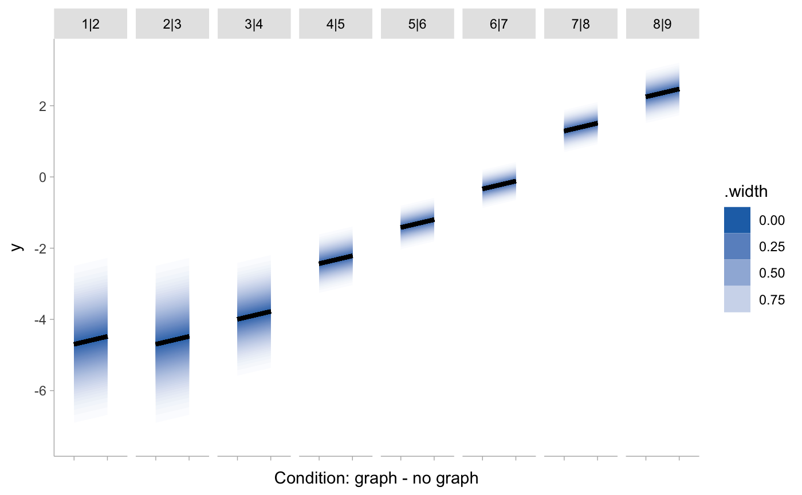
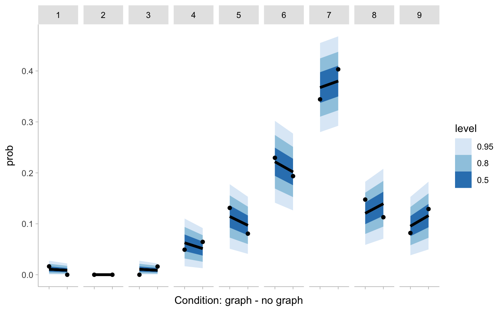
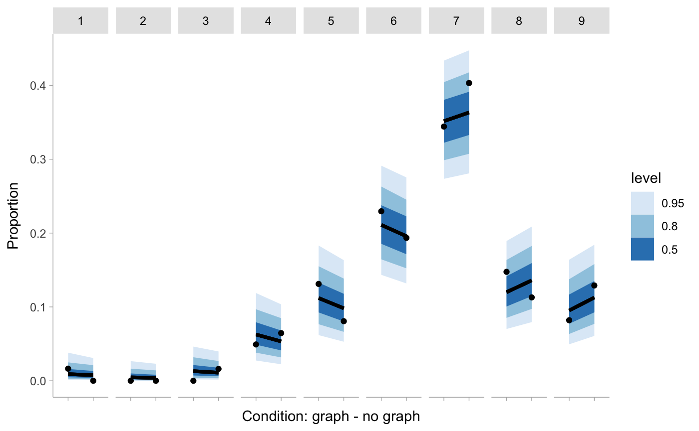
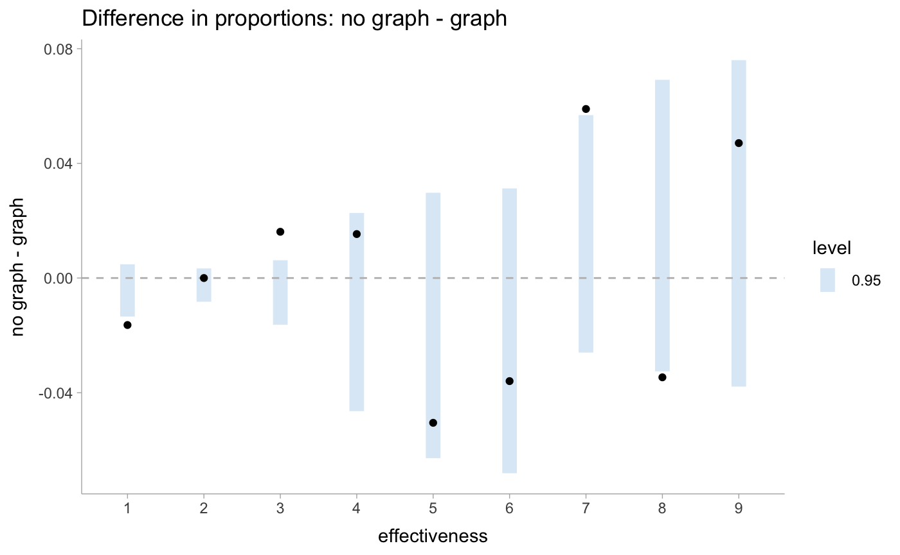

```{r setup, include=FALSE}
knitr::opts_chunk$set(echo = TRUE)
library(tidyverse)
library(tidymodels)
library(modelr)
library(brms)
library(tidybayes)
library(ggdist)
library(distributional)
library(ordinal)
library(ggrepel)
library(glue)
library(dabestr)
library(emmeans)

theme_set(theme_tidybayes())
```

## Introduction

We will revisit Datasets 1 from last time, focusing on exploring how to
make **visualizations** instead of doing the analysis. By the end of
this tutorial, you will learn to:

1.  Apply the **Grammar of Graphics** to build simple plots
2.  Identify the types of **uncertainty** from model outputs and modify
    code to visualize model outputs and uncertainty
3.  Use resources to find options for making a plot more **expressive**
    and evaluate its **usability**

### Expectations

I will mainly be coding here during this tutorial. You have the same
skeleton code in your Rstudio Cloud. Ideally, you will follow along and
write code with me. There are many activities where you can
**participate** and ask **questions** (any time!). We will gradually
transition from me providing examples to you creating your own plots.

Two files:

-   `session-3-vis.Rmd` (this document we're working on)
-   `session-3-vis-ref.Rmd` (the "answer key" document, with the
    exercises filled in)

### Pre-survey

What makes a plot? How do you systematically describe a plot, like
linguists using **grammar** to describe a language?

**Poll** (reply in Zoom chat)

-   Have you used ggplot before? \[Y/N\]

-   How familiar are you with "Grammar of Graphics"? \[1..5\]

    -   1: Haven't heard of it
    -   5: Very familiar, know how it relates to ggplot

It's OK if you don't know everything yet! It's all part of the plan 🤔

(Review survey response)

------------------------------------------------------------------------

## Activity 1: exploring data

First, we will learn the "grammar" behind ggplot. By the end of this
activity, you will be able to read and write basic ggplot specifications
and understand what you're doing. Also, you need to explore and
understand the raw data before doing analysis anyways.

### Load the data

We will base our example on the `blinded.csv` dataset. It's from an
experiment about whether showing people graphs increase belief in drug
efficacy, presumably because graphs are associated with science.

**TIP**: `()` enclosing an assignment will print the assigned value as
well.

```{r}
(df1 <- read_csv("data/blinded.csv", show_col_types = FALSE) %>%
  filter(experiment == 1) %>%
  mutate(
    condition = factor(condition), 
    participant_id = paste0("P", str_pad(row_number(), 2, pad = "0"))) %>%
   select(-experiment)
)
```

### Explore the data with ggplot

Last time, we modeled how `condition` (graph or no graph) affected
`effectiveness`, a Likert scale rating from 1 to 9.

To start out, we will create a scatterplot of effectiveness vs.
condition. Your plot will end up like this


The ggplot specification is the following:

```{r}
df1 %>%
  ggplot(aes(
    x = effectiveness, 
    y = condition)) +  
  geom_point() +
  scale_x_continuous(breaks = 1:9)
```

Let's break it down in terms of the (layered) Grammar of Graphics
concepts so that we can understand how ggplot works:

**Notability doodling**

-   `ggplot`: creates the "default layer"

-   `geom_point()`: Mark/geometry of type point, also a layer

-   `aes`: Aesthetics, aka visual channel encoding. If `aes()` is within
    `ggplot`, the mappings apply to all layers, unless other layers
    override them.

        x <- effectiveness 
        y <- condition

**REFLECTION**: is this plot good? Is it showing all the data points?
(Think *expressiveness*)

**Solution**:

```{r}
jitterer <- position_jitter(height = 0.1, seed = 1)
```

Let's write the Grammar of Graphics spec and add more "color" to it
(color the points by `condition` variable)

**PREDICT**: how should the new spec look like?

    ggplot
        x <- effectiveness 
        y <- condition
    geom_point

```{r}
df1 %>%
  ggplot(aes(
    x = effectiveness, 
    y = condition,
    # EXERCISE: add color
    color = condition
  )) +     
  # EXERCISE: make points jitter
  geom_point(position = jitterer) +       
  scale_x_continuous(breaks = 1:9)
```

**TIP**: Common problem and how to fix:

```{r eval=FALSE}
df1 %>%
  ggplot() +  
  geom_point(
    x = effectiveness, 
    y = condition,
    color = condition, 
    position = jitterer)
```

**RELFECTION:** any questions about Grammar of Graphics/ggplot syntax so
far?

## Activity 2: t-test/simple linear regression

The two tables are a roadmap of what we're going to do: mapping
uncertainty onto different representations

1.  Understand types of uncertainty

+-------------------+--------------------------------------------+
| Uncertainty type  | From data/model outputs                    |
+===================+============================================+
| (Intrinsic)       | ?                                          |
+-------------------+--------------------------------------------+
| Parameter         | ?                                          |
+-------------------+--------------------------------------------+
| Prediction        | ?                                          |
+-------------------+--------------------------------------------+

2.  Know how to show (the different types of) uncertainty. **PREDICTION**:
which representation is most expressive?

| Uncertainty representation | Frequentist | Bayesian |
|----------------------------|-------------|----------|
| Table summary              | TODO        |          |
| Point estimate             |             |          |
| Interval                   |             |          |
| Distribution               |             |          |

### Load Frequentist and Bayesian models

t-test is equivalent to a linear model estimating two means. For the
frequentist version, we are using `lm` because the output is easier to
wrangle (good explainer:
<https://lindeloev.github.io/tests-as-linear/#61_one-way_anova_and_kruskal-wallis>)

```{r}
(m_t_test <- lm(effectiveness ~ - 1 + condition, data = df1))
```

The Bayesian t-test:

```{r}
(m_t_test_bayesian <- readRDS("../02-bayesian_stats/rds/dataset1.brm.bayesiant.rds"))
```

### Build dataframes for table views

**Table** is the most basic way of reporting the results.

Tables for confidence/credible interval (CI), or **parameter
uncertainty:**

For the **frequentist** analysis:

```{r}
(means_t_freq <- m_t_test %>% 
   tidy() %>%
   mutate(condition = str_remove(term, "condition"), .before = 1) %>%
   select(-term)
)
```

How to interpret this table:

-   `estimate` column is for the estimates of the conditional means

-   `std.error` is the standard error for each mean, and we can get
    confidence intervals (CI) from it later

    -   Math:
        $\sqrt{MSE \left(\frac{1}{n} + \frac{(x_h - \bar{x})^2}{\sum{(x_i - \bar{x})^2}}\right)}$

    -   **REFLECTION**: what kind of uncertainty is this?

-   `statistic` is the value of a T-statistic

-   95% CI ($\alpha = 0.05$) is
    $t_{1 - 0.05/2, df} \times \sqrt{MSE \left(\frac{1}{n} + \frac{(x_h - \bar{x})^2}{\sum{(x_i - \bar{x})^2}}\right)}$,
    where the t-multiplier $t_{1 - 0.05/2, df}$ is calculated as
    `qt(1 - 0.05/2, df)`.

For the **Bayesian model**, we get draws from the posterior predictive
*expectations* (means) of all the parameters of the t-distribution
($\mu$/`.epred`, $\sigma$, $\nu$). There is credible interval (CI) for
Bayesian models, but we're not summarizing intervals yet.

```{r }
(means_t_bayes <- data_grid(df1, condition) %>%
  add_epred_draws(m_t_test_bayesian, newdata = . ,dpar = TRUE))
```

From a bunch of samples to a summary table:

```{r }
means_t_bayes %>%
  median_qi(.epred, .width = c(0.95)) 
```

**Prediction interval (PI), and prediction uncertainty**

**DISCUSSION**: Prediction uncertainty? Compared to parameter
uncertainty?

For the **frequentist** model. `.fitted` is the same as the `estimate`
above. `.se.pred` times the t-multiplier is the PI.
$t_{1 - 0.05/2, df} \times \sqrt{MSE \left(1 + \frac{1}{n} + \frac{(x_h - \bar{x})^2}{\sum{(x_i - \bar{x})^2}}\right)}$

NOTE on calculating the `se.pred`:
<https://online.stat.psu.edu/stat501/lesson/3/3.3> gives a good
explanation, and to translate the mathematical notation to R code:

-   MSE is `sum(residuals(m_t_test))/df.residual(m_t_test)`
-   Variance due to estimating the mean `.se.fit^2`
-   Variance due to variation in the response variable
    `residual.scale^2`
-   The standard error of prediction is the square root of the two
    variances combined

```{r}
# predict() returns $residual.scale
preds_t_freq_obj <- predict(m_t_test, newdata = data_grid(df1, condition), 
                     se.fit=TRUE, interval = "prediction", level = 0.95)

(preds_t_freq <- m_t_test %>%
  augment(newdata = data_grid(df1, condition), se_fit = TRUE) %>%
  mutate(
    .se.pred = sqrt(.se.fit ^ 2 + preds_t_freq_obj$residual.scale^2), # NOTE
    df = preds_t_freq_obj$df
  ) 
)
```

Predictions for the Bayesian model: get draws from the posterior
predictive distribution (different from `epred` from above!)

```{r}
(preds_t_bayes <- data_grid(df1, condition) %>%
    add_predicted_draws(m_t_test_bayesian))

preds_t_bayes %>%
  median_qi(.width = 0.95)
```

### Point estimates of the mean

Remember the scatterplot we made earlier?

**Frequentist** `lm()` model, plot estimates of the mean effectiveness
by condition:

**EXERCISE**: First, use pseudo Grammar of Graphics/ggplot to articulate
what you want

    geom_point
      x <- estimate 
      y <- condition

```{r }
means_t_freq %>%
  ggplot(aes(x = estimate, y = condition)) + 
  geom_point() +
  scale_x_continuous(breaks = 1:9, limits = c(1, 9)) + 
  labs(title = "Frequentist lm(), estimated effectiveness by condition") +
  NULL
```

**Bayesian** and frequentist combined, because why not?

    geom_point
      x <- estimate 
      y <- condition
      color <- model

```{r}
# EXERCISE: add the frequentist point estimates to the plot
(p_pt_est <- means_t_bayes %>%
  median_qi(.epred, .width = c(0.95)) %>%
  ggplot(aes(x = .epred, y = condition)) + 
  geom_point(aes(color = "Bayesian")) + 
  geom_point(
    aes(x = estimate, 
    color = "Frequentist"), 
    data = means_t_freq, 
    position = position_nudge(y = -0.1)) + 
  scale_x_continuous("Effectiveness", breaks = 1:9, limits = c(1, 9)) + 
  scale_color_manual("Model", 
                     breaks = c("Bayesian", "Frequentist"), 
                     values  = c("#45829f", "#000000") ) +
  labs(title = "Estimated effectiveness by condition") +
  NULL
)

# REFLECTION: what just happened? How is that legend generated?
# TOOL! https://yjunechoe.github.io/posts/2022-03-10-ggplot2-delayed-aes-1/
# layer_data(p_pt_est, i = 1)
```

**REFLECTION**: point estimates don't show uncertainty at all. (So this
model comparison isn't that great)

### Intervals - parameter and prediction uncertainty

Add interval for uncertainty. For the **frequentist** model, the
*confidence distribution* for the parameters follows the student-t
distribution.
<https://mjskay.github.io/ggdist/articles/freq-uncertainty-vis.html>

We won't calculate CI intervals directly. Instead we'll calculate the
standard errors and use `distributional::dist_student_t` and `ggdist`
functions.

All we need are the three parameters we calculated earlier

-   df: degree of freedom (N-2)
-   mu: estimate/.fitted for the mean ... `estimate` column is for the
    estimates of the group means
-   sigma: standard error ... `std.error` is the standard error. Math:
    $\sqrt{MSE \left(\frac{1}{n} + \frac{(x_h - \bar{x})^2}{\sum{(x_i - \bar{x})^2}}\right)}$

Note: `dist_student_t` only works with `xdist` aesthetic from the
`ggdist` package.

    ggdist::stat_pointinterval
      xdist <- student_t(df, mu, sigma) 
      y <- condition

**REFLECTION**: how would you plot it if you aren't using
`xdist`/`dist_student_t`?

**REFLECTION**: why is it `stat_*`, not `geom_*`?

```{r }
means_t_freq %>%
  ggplot(aes(
    xdist = dist_student_t( 
      df = df.residual(m_t_test), 
      mu = estimate, 
      sigma = std.error), 
    y = condition)) + 
  # EXERCISE: add 0.66 as another CI level
  stat_pointinterval(.width = c(0.66, 0.95)) +
  scale_x_continuous("effectiveness", breaks = 1:9, limits = c(1, 9)) + 
  labs(title = "Frequentist lm(), estimated effectiveness by condition",
       subtitle = "Confidence interval widths: 0.66 and 0.95") +
  NULL
```

The **prediction distribution** also follows the t-distribution, so we
only need to change the `sigma` parameter. Show that PI is wider than
the CI in the plot below!

```{r}
preds_t_freq %>%
  ggplot(aes(y = condition)) + 
  # EXERCISE: show PI with stat_interval()
  stat_interval(aes(
    xdist = dist_student_t(
      df = df,
      mu = .fitted, 
      sigma = .se.pred) 
  )) + 
  
  stat_pointinterval(aes(
    xdist = dist_student_t( # EXERCISE: what does this mean?
      df = df,
      mu = .fitted,
      sigma = .se.fit)),
    position = position_nudge(y = -.2)) +
  
  # EXERCISE: put raw data in this plot
  geom_point(
    aes(x = effectiveness), 
    data = df1, position = jitterer) +
  scale_x_continuous("effectiveness", breaks = 1:11, limits = c(0, 11)) + 
  scale_color_brewer("Predictive interval") + 
  labs(title = "Frequentist lm(), estimated effectiveness by condition",
       subtitle = "Confidence interval widths: 0.66 and 0.95") +
  NULL
  
```

Replicate the CI+PI plot above, but with the **Bayesian** model

**REFLECTION**: can we still use `dist_student_t`?

**EXERCISE**: Visualize parameter uncertainty, predictive uncertainty,
and the intrinsic uncertainty in data:

      (which visual element?) <- (Parameter uncertainty)
      (which visual element?) <- (Predictive uncertainty)
      (which visual element?) <- (Intrinsic uncertainty in data)

```{r}
df1 %>%
  ggplot(aes(x = effectiveness, y = condition)) + 
  # EXERCISE: fill this out
  stat_interval(
    aes(x = .prediction), 
    data = preds_t_bayes) +
  stat_pointinterval(
    aes(x = .epred), 
    data = means_t_bayes,
    .width = c(.66, .95),
    position = position_nudge(y = -0.2)) +
  geom_point(position = jitterer) +
  # END EXERCISE
  scale_x_continuous(breaks = 1:9)+
  scale_color_brewer("Predictive interval") + 
  labs(title = "Bayesian lm(), estimated effectiveness by condition",
       subtitle = "Credible interval widths: 0.66 and 0.95") +
  NULL
```

### Distributions - parameter and prediction uncertainty

EXERCISE: What encoding do you prefer? How to look for more options?

<https://mjskay.github.io/ggdist/>

REFLECTION: how would you categorize all these options?

-   continuous (`stat_slab`) vs. discrete (`stat_dots`)
-   intervals (`stat_interval`) vs. distribution (`stat_slab`) vs. both
    (`stat_halfeye`)

```{r}
means_t_freq %>%
  ggplot(aes(y = condition)) +
  # EXERCIESE: add raw data
  geom_point(
    aes(
      x = effectiveness,
      y = condition),
    data = df1, position = jitterer, alpha = .5) +
  stat_halfeye(             # EXERCIESE: change to stat_dots
    aes(xdist =dist_student_t(
      df = df.residual(m_t_test), 
      mu = estimate, 
      sigma = std.error)),
    scale = 0.5, fill = "#8c96c6",
    position = position_nudge(y = 0.15)) + 
  
  geom_label_repel(
    aes(estimate + 0.25, y = condition), 
    data = means_t_freq %>% slice_tail(),
    label = "CI of the mean", box.padding = 1,
    position = position_nudge(y = 0.3), max.overlaps = Inf, seed = 15) +
  # EXERCISE: add a label for the raw data
  geom_label_repel(
    aes(x = estimate, y = condition),
    data = means_t_freq %>% slice_head(),
    label = "Jittered raw data", box.padding = 1,
    position = position_nudge_repel(y = -0.2), seed = 1) +
  scale_x_continuous(breaks = 0:10, limits = c(0, 10)) + 
  labs(title = "Frequentist lm(), confidence distribution of effectiveness by condition") + 
  NULL

```

Prediction distribution for the frequentist model:

```{r}
preds_t_freq %>%
  ggplot(aes(y = condition)) + 
  stat_slab(
    aes(xdist = dist_student_t(
      df = df, 
      mu = .fitted, 
      sigma = .se.pred)),
    slab_color="#9ECAE1", fill = NA, scale = 0.7) +
  geom_point(
    aes(
      x = effectiveness,
      y = condition),
    data = df1, position = jitterer, shape = 21, size =2) +
  stat_pointinterval(            
    aes(xdist =dist_student_t(
      df = df.residual(m_t_test), 
      mu = estimate, 
      sigma = std.error)),
    data = means_t_freq,
    scale = 0.5, fill = "#8c96c6",
    position = position_nudge(y = 0.15)) + 
  scale_x_continuous(breaks = 1:9) +
  labs(title = "Frequentist lm(), effectiveness by condition",
       subtitle = "Curves show the prediction distributions\nIntervals show confidence intervals") + 
  NULL
```

This type of plot is sometimes called Kruschke style in Bayesian context
<https://solomonkurz.netlify.app/post/2018-12-20-make-rotated-gaussians-kruschke-style/>.
The bunch of density lines shows both parameter and predictive
uncertainty (why?)

```{r}
means_t_bayes %>%
  sample_draws(30) %>%
  ggplot(
    aes(y = condition)) + 
  stat_slab(
    aes(xdist = dist_student_t(nu, mu, sigma)),
    slab_color="#9ECAE1", alpha = 0.1, fill = NA, scale = 0.7) +
  # stat_pointinterval(
  #   aes(x = mu), 
  #   position = position_nudge(y = 0.15)) +
  geom_point(
    aes(x = effectiveness), data = df1,
    shape = 21, size = 2,
    position = jitterer) +
  scale_x_continuous(breaks = 1:9, limit = c(0, 11)) + 
  labs(title = "Bayesian t-test, effectiveness by condition",
       subtitle = "Curves show the prediction distributions\nIntervals show credible intervals") + 
  NULL
```

**REFLECTION**: should you show confidence or prediction distribution, or
both? Should you use intervals or distributions for uncertainty?


BREAK

-----


## Activity 3: Ordinal logistic regression

Now you will design your own plots for the frequentist and Bayesian
ordinal linear regression. You have data exploration and model output
summaries below.

### Considerations and resources

-   What does the model look like? How does it work?
-   What are the parameter and prediction uncertainty?
-   How do I want to visualize the uncertainties? (Interval?
    distribution?)
-   (Bayesian) OLR
    <https://bookdown.org/ajkurz/Statistical_Rethinking_recoded/monsters-and-mixtures.html#ordered-categorical-outcomes>

### Data exploration and how cumulative logit works

The same `df1` data, but summarized to show proportion of each
effectiveness level (1-9).

```{r}
(df1_prop <- df1 %>%
  count(condition, effectiveness) %>%
  add_row(condition = "graph", effectiveness = 2, n = 0) %>%
  complete(condition, effectiveness, fill = list(n = 0)) %>%
  group_by(condition) %>%
  mutate(prob = n/sum(n))
)

df1_prop %>%
  ggplot(aes(x = effectiveness, y = prob, color = condition)) + 
  geom_point() + 
  geom_line() + 
  scale_x_continuous(breaks = 1:9) + 
  NULL
```

Building up to the ordinal linear regression model... introducing the
cumulative proportions ("odds"), and cumulative log odds (computed with
`logit()`)

```{r}
logit <- function(x) log(x / (1 - x))

(cumu_df1 <- df1 %>%
  count(condition, effectiveness, name = "n") %>%
  add_row(condition = "graph", effectiveness = 2, n = 0) %>%
  complete(condition, effectiveness, fill = list(n = 0)) %>%
  group_by(condition) %>%
  mutate(
    pr_k = n / sum(n),
    cum_pr_k = cumsum(pr_k),
    cum_pr_k_1 = cum_pr_k - (pr_k),
    logit_cum_pr_k = logit(cum_pr_k))
)
```

The first figure, but on log cumulative odds scale. Can you interpret
the labeled numbers?

```{r}
cumu_df1 %>%
  filter(!is.infinite(logit_cum_pr_k)) %>%
  ggplot(aes(x = effectiveness, y = logit_cum_pr_k, color = condition, label = round(logit_cum_pr_k, 2))) + 
  geom_vline(xintercept = 6) + 
  geom_label_repel(data = cumu_df1 %>% filter(effectiveness == 6)) + 
  geom_point() + 
  geom_line() + 
  scale_x_continuous(breaks = 1:9) + 
  ylab("log-cumulative-odds")
```

Once we have the estimates in the cumulative log odds space, can do
inverse logit (`brms::inv_logit_scaled()`), and get proportions out of
the cumulative proportions. The vertical straight lines are the
individual proportions at each effectiveness level.

```{r}
cumu_df1 %>%
  ggplot(aes(x = effectiveness, y = cum_pr_k)) + 
  geom_line() +
  geom_segment(aes(
    x = effectiveness, 
    xend = effectiveness,
    y = cum_pr_k, 
    yend = cum_pr_k_1),
    color = "grey") +
  geom_segment(aes(
    x = effectiveness - 1, 
    xend = effectiveness,
    y = cum_pr_k_1, 
    yend = cum_pr_k_1),
    linetype = "dotted", color = "grey") +
  geom_point() +
  scale_x_continuous(breaks = 1:9) + 
  facet_grid(~condition)
```

### Frequentist model

Frequentist

```{r}
(m_polr <- df1 %>% 
  mutate(effectiveness = ordered(effectiveness, levels = as.character(1:9))) %>% 
  MASS::polr(effectiveness ~ condition, data = ., Hess=TRUE) 
)
```

Estimates of the intercepts on the logit scale

```{r}
tidy(m_polr)
```

Estimates on the probability scale

```{r}
(means_olr_freq <- emmeans(m_polr,  ~ condition + effectiveness, mode = "prob") %>%
  as.data.frame()
)
```

EXERCISE: plot estimates on the cumulative log odds scale. One option:


```{r}
tidy(m_polr) %>%
 mutate(delta = first(estimate)) %>%
  dplyr::slice(-1) %>%
  crossing(condition = data_grid(df1, condition) %>% pull(condition))  %>%
  mutate(estimate = ifelse(condition == "no_graph", estimate + delta, estimate)) %>%
  select(-delta) %>%
  ggplot() + 
  stat_lineribbon(aes(
    x = condition,
    ydist = dist_normal(
      mu = estimate,
      sigma = std.error),
    fill_ramp = stat(.width)), .width = ppoints(50), fill = "#2171b5"
  ) +
  facet_grid(~ term) + # EXERCISE: uncomment to see data better
  scale_fill_ramp_continuous(range = c(1, 0)) +
  theme(axis.text.x = element_blank()) + 
  xlab("Condition: graph - no graph") + 
  NULL
```

EXERCISE: On the probability scale. One design:



```{r}
means_olr_freq %>%
  ggplot(aes(x = condition, y = prob, group = effectiveness)) + 
  stat_lineribbon(aes(
    ydist = dist_truncated(dist_normal(mu = prob, sigma = SE), lower = 0)
  )) +
  geom_point(data = df1_prop) +
  facet_grid(~ effectiveness) + # EXERCISE: uncomment to see data better
  theme(axis.text.x = element_blank()) + 
  scale_fill_brewer() +
  xlab("Condition: graph - no graph") + 
  NULL
  
```

### Bayesian OLR

Load the data

```{r dat1-bayesian-model3}
(m_olr_bayes <- readRDS("../02-bayesian_stats/rds/dataset1.brm.olr1.rds"))
```

Get posterior estimates for the parameters and predictions (outcome on
the scale of 1...9)

```{r}
(means_olr_bayes <- expand(df1, condition) %>%
  add_epred_draws(m_olr_bayes, dpar = TRUE) %>%
   rename(effectiveness = .category)
)
```

```{r}
(preds_olr_bayes <- df1 %>%
    add_predicted_draws(m_olr_bayes) %>%
    select(-c(.chain, .iteration)) %>%
   drop_na()
 )

```

EXERCISE: make a plot for those mean estimates! One design:


```{r}
means_olr_bayes %>%
  ggplot(aes(x = condition, y = .epred)) + 
  stat_lineribbon()  + 
  geom_point(aes(x = condition, y = prob), data = df1_prop) + 
  scale_fill_brewer() + 
  facet_grid(~ effectiveness) +
  theme(axis.text.x = element_blank()) + 
  xlab("Condition: graph - no graph") + 
  ylab("Proportion")
```


```{r}
(means_df1_olr_compare <- means_olr_bayes %>%
  group_by(effectiveness) %>%
  compare_levels(variable = .epred, by = condition ) 
)

(df1_prop_diff <- df1_prop %>%
  pivot_wider(id_col = effectiveness, names_from = condition, values_from = prob) %>%
  drop_na() %>%
  mutate(diff = no_graph - graph)
)
```


EXERCISE: compare the two conditions


```{r}
means_df1_olr_compare %>%
  ggplot(aes(x = effectiveness, y = .epred)) + 
  stat_interval(.width = c(0.95)) +  # EXERCISE: can you be more expressive with uncertainty?
  geom_hline(                        # EXERCISE: add reference line y = 0
    yintercept = 0, linetype = "dashed", color = "grey") + 
  geom_point(aes(y = diff), data= df1_prop_diff) +  #EXERCISE: add raw data
  scale_color_brewer() + 
  ylab("no graph - graph") + 
  labs(title = "Difference in proportions: no graph - graph") + 
  NULL
```

RELFECTION: how else to show the prediction uncertainty? 

```{r}
preds_olr_bayes %>%
  count(.row, condition, .prediction) %>%
  mutate(prob = n / sum(n)) %>%
  ggplot(aes(.prediction, prob, group = .row, color = condition)) +
  geom_line(alpha = 0.05) + 
  NULL

```

## Packages Information

```{r}
sessionInfo()
```
