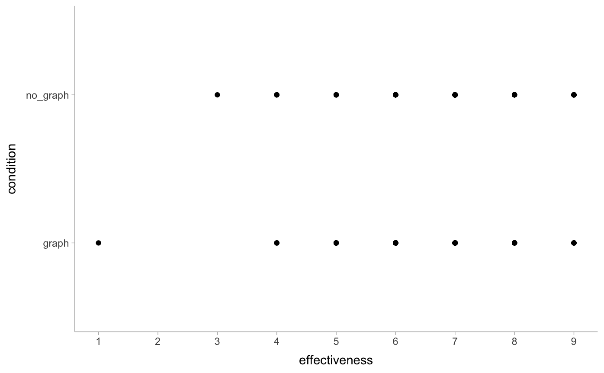

```{r setup, include=FALSE}
knitr::opts_chunk$set(echo = TRUE)
library(tidyverse)
library(tidymodels)
library(modelr)
library(brms)
library(tidybayes)
library(ggdist)
library(distributional)
library(ordinal)
library(ggrepel)
library(glue)
library(dabestr)

theme_set(theme_tidybayes())
```

## Introduction

We will revisit Datasets 1 and 2 from last time, focusing on exploring the **visualizations** instead of the analysis. By the end of this tutorial, you will learn to:

1.  Apply the **Grammar of Graphics** to build simple plots
2.  Identify the types of **uncertainty** from model outputs and modify code to visualize outputs and uncertainty
3.  Use resources to find options for making a plot more **expressive** and evaluate its **usability**

### Pre-survey

What makes a plot? How do you systematically describe a plot, like linguists using **grammar** to describe a language?

Go to ==TODO== (survey link)

It's OK if you're sure about your answers! It's all part of the plan 🤔

\[Review survey response and adjust timing accordingly\]

------------------------------------------------------------------------

## Activity 1: exploring data

### Load the data

```{r}
(df1 <- read_csv("data/blinded.csv") %>%
  filter(experiment == 1) %>%
  mutate(
    condition = factor(condition), 
    participant_id = paste0("P", str_pad(row_number(), 2, pad = "0")))
)
```

### Explore the data with ggplot

We modeled how `condition` (graph or no graph) affected `effectiveness`, a Likert scale rating from 1 to 9.

To start out, create a scatterplot of bill length versus bill depth for the three species. Your plot should look like this:



This is the Grammar of Graphics specification:

-   Visual channel encoding

    -   x-axis \<- effectiveness
    -   y-axis \<- condition

-   Mark/geometry: point

```{r}
df1 %>%
  ggplot(aes(
    x = effectiveness, 
    y = condition)) +  # EXERCISE: add color
  geom_point() +       # EXERCISE: change to jitter
  scale_x_continuous(breaks = 1:9)
```

Alternative: try aggregation

```{r}
df1 %>%
  count(effectiveness, condition, name = "n") %>%
  pivot_wider(names_from = condition, values_from = n, values_fill = 0)
```

Visualize the aggregated dataset

```{r}
df1 %>%
  count(condition, effectiveness, name = "n") %>%
  ggplot(aes(x = effectiveness, y = n, color = condition)) + 
  geom_point() +     # EXERCISE: change to line chart (geom_line)
  # EXERCISE: point + line??
  scale_x_continuous(breaks = 1:9)
```

|                         | Frequentist | Bayesian |
|-------------------------|-------------|----------|
| Table summary           |             |          |
| Point estimate          |             |          |
| Interval-parameter      |             |          |
| Distribution-parameter  |             |          |
| Interval-prediction     |             |          |
| Distribution-prediction |             |          |


## Activity 2: t-test

<!--## Dataset 1, frequentist land-->

### Wilcoxon

```{r}
m_wilcox <- wilcox.test(
    effectiveness ~ condition, 
    data = df1, paired = FALSE, conf.int = TRUE)

tidy(m_wilcox)
```

Reflection: is this interval surprising? Is this useful?

```{r}
tidy(m_wilcox) %>%
  ggplot(aes(x = estimate, y = 0)) + 
  geom_point() + 
  # EXERCISE: add intervals
  # geom_pointinterval(aes(xmin = conf.low, xmax = conf.high)) +
  scale_x_continuous(breaks = -1:9, limits = c(-1, 9))
```

### t-test

Baseline: table/textual reporting

```{r }
m_t_test <- t.test(
  effectiveness ~ condition - 1, 
  data = df1, paired = FALSE, conf.int = TRUE)
```

```{r }
m_t_test
```

t-test is equivalent to a linear model with a slope and intercept $y_i = \beta_0 + \beta_1 x_i$ (`1 + condition` below) so using `lm` because the output is easier to wrangle (good explainer: <https://lindeloev.github.io/tests-as-linear/#61_one-way_anova_and_kruskal-wallis>)

```{r}
(m_t_test <- lm(effectiveness ~ - 1 + condition, data = df1))
```

Tidy view of the t-test results

```{r }
m_t_test %>%
  tidy()
```

Point estimates

```{r }
tidy(m_t_test) %>%
  ggplot(aes(x = estimate, y = term)) + 
  geom_point() +
  scale_x_continuous(breaks=-1:9) + 
  scale_y_discrete(labels = c("Intercept (beta_0)", "condition: no graph"))
```

Add interval for uncertainty. The *confidence distribution* for the parameters follows the student-t distribution. <https://mjskay.github.io/ggdist/articles/freq-uncertainty-vis.html>

```{r }
tidy(m_t_test) %>%
  ggplot(aes(
    xdist = dist_student_t( # EXERCISE: what does this mean?
      df = df.residual(m_t_test), 
      mu = estimate, 
      sigma = std.error), 
    y = term)) + 
  stat_pointinterval() +
  scale_x_continuous(breaks=-1:9) + 
  scale_y_discrete(labels = c("Intercept (beta_0)", "condition: no graph"))
```

That was for the paramters. Now we make predictions () with `augment`

```{r }
(aug_df1 <- df1 %>%
  data_grid(condition) %>%
  augment(m_t_test, newdata = ., se_fit = TRUE)
)
```

EXERCISE: why are the densities so narrow? Does it make sense? What encoding do you prefer?

```{r }
aug_df1 %>%
  ggplot(aes(y = condition)) +
  # geom_jitter(            # EXERCIESE: add raw data
  #   aes(
  #     x = effectiveness, 
  #     y = condition), 
  #   data =df1, height = 0.05, alpha = .5) +  
  stat_halfeye(             # EXERCIESE: change to stat_dots
    aes(xdist =dist_student_t(
      df = df.residual(m_t_test), 
      mu = .fitted, sigma = .se.fit)),
    scale = 0.6, fill = "#8c96c6",
    position = position_nudge(y = 0.1)) + 
  geom_label_repel(aes(.fitted, y = condition), data = aug_df1 %>% slice_tail(),
                   label = "Confidence distribution of mu", box.padding = 1, 
                   position = position_nudge(y = 0.1), max.overlaps = Inf) + 
  # geom_label_repel( # EXERCISE: add labels for the raw data
  #   aes(.fitted, y = condition), 
  #   data = aug_df1 %>% slice_head(),
  #   label = "Jittered raw data", box.padding = 1,
  #   position = position_nudge_repel(y = -0.2)) +
  NULL

```

Predictions?

```{r}
(df1_grid <- df1 %>%
  data_grid(condition))

(t_mult <- qt(1 - 0.05/2, df.residual(m_t_test)))
```

```{r}
(obj_pred <- predict(m_t_test, newdata = df1_grid, 
                     se.fit=TRUE, interval = "prediction", level = 0.95))
```

Finding the standard error of the prediction

```{r}
(preds_df1_t_freq <- aug_df1 %>%
  mutate(.se.pred = sqrt(.se.fit ^ 2 + mean(residuals(m_t_test)^2))) %>%
  mutate(t_mult = t_mult, 
         df = df.residual(m_t_test),
         lower = .fitted - t_mult * obj_pred$residual.scale,
         upper = .fitted + t_mult * obj_pred$residual.scale,
         lower1 = .fitted - t_mult * .se.pred,
         upper1 = .fitted + t_mult * .se.pred)
)
```

```{r}
preds_df1_t_freq %>%
  ggplot(aes(y = condition)) + 
  stat_slab(
    aes(xdist = dist_student_t(
      df, .fitted, .se.pred)),
    slab_color="gray65", fill = NA, scale = 0.7) +
  geom_jitter(aes(x = effectiveness), data = df1, shape = 21, fill = "#9ECAE1",  size = 2, width = 0.1, height = 0.1) +
  scale_x_continuous(breaks = 1:9)
  NULL
```

<!--Show fit line with data-->

```{r}
# (coefficients <- m_t_test %>%
#   tidy() %>%
#   mutate(term = c("intercept", "slope")) %>%
#   select(term, estimate) %>% 
#   deframe()
# )
```

```{r}
# df1 %>% 
#   ggplot(aes(x = ifelse(condition == "graph", 0, 1), y = effectiveness)) + 
#   stat_lineribbon(aes(
#     x = ifelse(condition == "graph", 0, 1), y = NULL, 
#     ydist = dist_student_t(
#       df = df.residual(m_t_test), 
#       mu = .fitted, sigma = .se.fit)), 
#     data = aug_df1, alpha = 0.3, fill = "#8c96c6") +
#   geom_count(color = "gray45") + 
#   geom_label_repel(
#     data = tibble(x =0.7, y = 0.7 * 0.18 + 6.57),
#     mapping = aes(x = x, y = y),
#     label = glue("y = {format(round(coefficients[\"intercept\"], 2), nsmall=2)} + {format(round(coefficients[\"slope\"], 2), nsmall=2)}x"), color = "#8c96c6", 
#     box.padding = 2) + 
#   labs(
#     title = "The t-test/lm fit line",
#     subtitle = "Is it good for discrete data?\nAlso, don't encode count as dot size") + 
#   xlab("condition") +
#   scale_x_continuous(breaks = c(0,1), labels = c("graph (x = 0)", "no graph (x = 1)"), limits = c(-0.5, 1.5)) 
```

### Ordinal linear regression

<https://bookdown.org/ajkurz/Statistical_Rethinking_recoded/monsters-and-mixtures.html#ordered-categorical-outcomes>

We've seen this before

```{r}
df1 %>%
  count(condition, effectiveness, name = "n") %>%
  ggplot(aes(x = effectiveness, y = n, color = condition)) + 
  geom_point() + 
  geom_line() + 
  scale_x_continuous(breaks = 1:9) + 
  NULL
```

Building up to the ordinal linear regression model... introducing the cumulative proportions ("odds"), and cumulative log odds (computed with `logit()`)

```{r}
logit <- function(x) log(x / (1 - x))

(cumu_df1 <- df1 %>%
  count(condition, effectiveness, name = "n") %>%
  add_row(condition = "graph", effectiveness = 2, n = 0) %>%
  complete(condition, effectiveness, fill = list(n = 0)) %>%
  group_by(condition) %>%
  mutate(
    pr_k = n / sum(n),
    cum_pr_k = cumsum(pr_k),
    cum_pr_k_1 = cum_pr_k - (pr_k),
    logit_cum_pr_k = logit(cum_pr_k))
)
```

```{r}
cumu_df1 %>%
  filter(!is.infinite(logit_cum_pr_k)) %>%
  ggplot(aes(x = effectiveness, y = logit_cum_pr_k, color = condition, label = round(logit_cum_pr_k, 2))) + 
  geom_vline(xintercept = 6) + 
  geom_label_repel(data = cumu_df1 %>% filter(effectiveness == 6)) + 
  geom_point() + 
  geom_line() + 
  scale_x_continuous(breaks = 1:9) + 
  ylab("log-cumulative-odds")
```

Once we have the estimates in the cumulative log odds space, can do inverse logit (`brms::inv_logit_scaled()`), and get proportions out of the cumulative proportions.

```{r}
cumu_df1 %>%
  ggplot(aes(x = effectiveness, y = cum_pr_k)) + 
  geom_line() +
  geom_segment(aes(
    x = effectiveness, 
    xend = effectiveness,
    y = cum_pr_k, 
    yend = cum_pr_k_1),
    color = "grey") +
  geom_segment(aes(
    x = effectiveness - 1, 
    xend = effectiveness,
    y = cum_pr_k_1, 
    yend = cum_pr_k_1),
    linetype = "dotted", color = "grey") +
  geom_point() +
  scale_x_continuous(breaks = 1:9) + 
  facet_grid(~condition)
```

```{r dat1-frequentist-model3}
# (m_olr_freq <- df1 %>% 
#   mutate(effectiveness = ordered(effectiveness, levels = as.character(1:9))) %>% 
#   ordinal::clm(effectiveness ~ condition, data = .)
# )
# 

(m_polr <- df1 %>% 
  mutate(effectiveness = ordered(effectiveness, levels = as.character(1:9))) %>% 
  MASS::polr(effectiveness ~ condition, data = ., Hess=TRUE) 
)

```

```{r}
tidy(m_olr_freq)
tidy(m_polr)
```

```{r}
(condition_no_graph <- tidy(m_olr_freq) %>% slice_tail())
```

Showing estimates on the cumulative log odds scale

```{r}
tidy(m_olr_freq) %>%
  dplyr::slice(-n()) %>%
  crossing(condition = c("graph", "no_graph")) %>%
  mutate(estimate = 
           ifelse(condition == "no_graph", 
                  estimate + condition_no_graph$estimate, 
                  estimate)) %>%
  mutate(.upper = estimate + 1.96 * std.error, 
         .lower = estimate - 1.96 * std.error)  %>%
  mutate(condition = factor(ifelse(condition == "graph", 0, 1))) %>%
  ggplot(aes(x = condition, y = estimate, group = term)) + 
  facet_grid(~ term) + # EXERCISE: uncomment to see data better
  geom_lineribbon(aes(ymin = .lower, ymax = .upper, color = term), alpha = 0.4) + 
  scale_color_viridis_d() 

```
ACHTUNG: the quest for PI

```{r}
predict(m_olr_freq,newdata = df1_grid, se.fit = TRUE, type = "prob")

# augment doesn't work
```

Going back to the data space... show predicted proportions and uncertainty

```{r}
# EXERCISE: how to show uncertainty with this?

as.data.frame(predict(m_olr_freq, type.predict = "prob", se.fit = TRUE)) %>%
  bind_cols(df1 %>% select(effectiveness, condition))  %>%
  group_by(effectiveness, condition) %>% 
  slice_head() %>%
  ungroup()   %>%
  ggplot(aes(x = effectiveness, y = fit, fill = condition)) + 
  geom_col(position = "dodge") + 
  # geom_pointinterval(   # EXERCISE: put in the interval 
  #   aes(ymin = fit - 1.96 * se.fit, ymax = fit + 1.96 * se.fit),
  #   position = "dodge") + 
  scale_x_continuous(breaks = 1:9) + 
  ylab("Proportion")
```

## Dataset 1, Bayesian land

### Dataset 1, Bayesian t-test

Load the model from last time....

```{r }
(m_t_test_bayesian <- readRDS("../02-bayesian_stats/rds/dataset1.brm.bayesiant.rds"))
```

Get estimates for parameters and outcome predictions (1..9).

```{r }
(grid_df1<- df1 %>%
  data_grid(condition, effectiveness) 
)
```

```{r }
(means_df1_t <- grid_df1 %>%
  add_epred_draws(m_t_test_bayesian, newdata = . ,dpar = TRUE))
```

```{r }
(preds_df1_t <- grid_df1 %>%
    add_predicted_draws(m_t_test_bayesian))
```

Visualize parameter uncertainty, predictive uncertainty, and raw data.

EXERCISE:

-   (which visual element?) \<- Parameter uncertainty
-   (which visual element?) \<- Predictive uncertainty
-   (which visual element?) \<- Raw data (with intrinsic uncertainty, too!)

```{r}
df1 %>%
  ggplot(aes(x = effectiveness, y = condition)) + 
  stat_interval(aes(x = .prediction), data = preds_df1_t) +
  
  # EXERCISE: change to density plot
  stat_pointinterval(aes(x = .epred), data = means_df1_t,
                     .width = c(.66, .95),
                     position = position_nudge(y = -0.2)) +
  geom_jitter(height = 0.1) +
  scale_x_continuous(breaks = 1:9)+
  scale_color_brewer()
```

An alternative way of seeing the uncertainty, in Kruschke style. The bunch of density lines shows both parameter and predictive uncertainty.

```{r}
means_df1_t %>%
  sample_draws(30) %>%
  ggplot(aes(y = condition)) + 
  stat_slab(
    aes(xdist = dist_student_t(nu, mu, sigma)),
    slab_color="gray65", alpha = 0.05, fill = NA, scale = 0.7) +
  geom_jitter(aes(x = effectiveness), data = df1, shape = 21, fill = "#9ECAE1",  size = 2, width = 0.1, height = 0.1) +
  scale_x_continuous(breaks = 1:9)
  NULL
```

### Dataset 1, Bayesian OLR

There're starter values and stuff, not bothered just yet <https://bookdown.org/ajkurz/Statistical_Rethinking_recoded/monsters-and-mixtures.html#ordered-categorical-outcomes>

```{r dat1-bayesian-model3}
(m_olr_bayes <- readRDS("../02-bayesian_stats/rds/dataset1.brm.olr1.rds"))
```

Get posterior estimates for the parameters and predictions (outcome on the scale of 1...9)

```{r}
(means_df1_olr <- expand(df1, condition) %>%
  add_epred_draws(m_olr_bayes, dpar = TRUE) %>%
   rename(effectiveness = .category)
)
```
```{r}
means_df1_olr %>%
  group_by(.draw) %>%
  filter(cur_group_id()== 1)
```

```{r}
(preds_df1_olr <- expand(df1, condition) %>%
    add_predicted_draws(m_olr_bayes) %>%
    select(-c(.chain, .iteration)) %>%
   drop_na()
 )

preds_df1_olr %>%
  ungroup() %>%
  expand(nesting(.draw))

```

EXERCISE: why does this look different from the frequentist version?

```{r}
(df1_prop <- df1 %>%
  count(condition, effectiveness) %>%
  group_by(condition) %>%
  mutate(prop = n/sum(n))
)

means_df1_olr %>%
  ggplot(aes(x = condition, y = .epred)) + 
  stat_lineribbon()  + 
  geom_point(aes(x = condition, y = prop), data = df1_prop) + 
  scale_fill_brewer() + 
  facet_grid(~ effectiveness) +
  theme(axis.text.x = element_blank()) + 
  xlab("Condition: graph - no graph") + 
  ylab("Proportion")
```

EXERCISE (challenge): follow <https://bookdown.org/ajkurz/Statistical_Rethinking_recoded/monsters-and-mixtures.html#ordered-categorical-outcomes> to construct a stacked version

```{r}
(means_df1_olr_compare <- means_df1_olr %>%
  group_by(effectiveness) %>%
  compare_levels(variable = .epred, by = condition ) 
)

(df1_prop_diff <- df1_prop %>%
  pivot_wider(id_col = effectiveness, names_from = condition, values_from = prop) %>%
  drop_na() %>%
  mutate(diff = no_graph - graph)
)

means_df1_olr_compare %>%
  ggplot(aes(x = effectiveness, y = .epred)) + 
  stat_interval(.width = c(0.95)) +  # EXERCISE: can you be more expressive with uncertainty?
  geom_hline(                        # EXERCISE: add reference line y = 0
    yintercept = 0, linetype = "dashed", color = "grey") + 
  geom_point(aes(y = diff), data= df1_prop_diff) +  #EXERCISE: add raw data
  scale_color_brewer() + 
  ylab("no graph - graph") + 
  labs(title = "Difference in proportions: no graph - graph") + 
  NULL
```

```{r}
preds_df1_olr %>%
  count(condition, .prediction) %>%
  ggplot(aes(.prediction, n, fill = condition)) +
  geom_col(position = "dodge")

```

## Packages Information

```{r}
sessionInfo()
```
