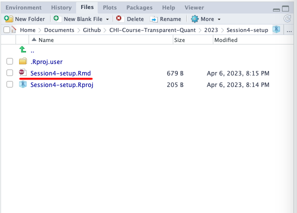
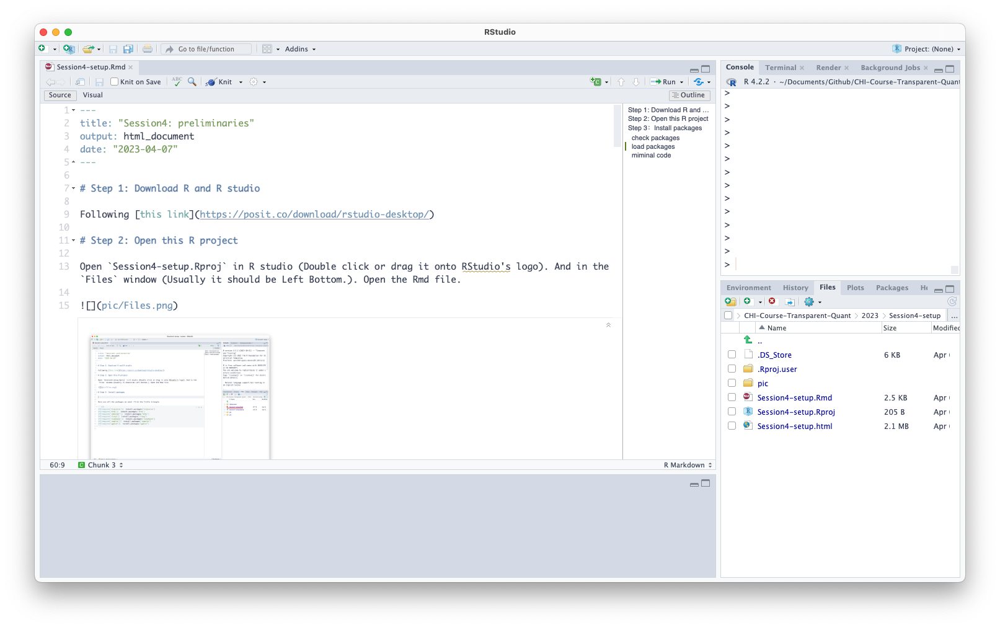

# Step 1: Download R and R studio

Following [this link](https://posit.co/download/rstudio-desktop/)

# Step 2: Open this R project

Open `Session4-setup.Rproj` in R studio (Double click or drag it onto RStudio's logo). And in the `Files` window (Usually it should be Left Bottom.). Open the Rmd file.



You should see something like this. The theme and layout might be different.



# Step 3：Install packages

Here are all the packages we need. Click the little triangle on the left most. The color might be different.

This allows you to install all packages you need for this session. This process may take more than half an hour. So be patient.

You might have problems when installing [cmdstanr](https://mc-stan.org/cmdstanr/). You might want to refer to [CmdStan Installation Manual](https://mc-stan.org/docs/cmdstan-guide/cmdstan-installation.html). However, if it really does not work, you can skip this package but you must have others.


```{r message=FALSE, warning=FALSE}
if(!require('tidyverse'))  install.packages('tidyverse')
if(!require('brms'))  install.packages('brms')
if(!require('rlang'))  install.packages('rlang')
if(!require('tidybayes'))  install.packages('tidybayes')
if(!require('cowplot'))  install.packages('cowplot')
if(!require('ggdist'))  install.packages('ggdist')
if(!require('cmdstanr'))  install.packages('brms')
```


## check packages

```{r}
library(cmdstanr)
check_cmdstan_toolchain(fix = TRUE, quiet = TRUE)
```

## load packages

```{r}
library(tidyverse)
library(brms)
library(rlang)
library(tidybayes)
library(cowplot)
library(ggdist)
```


## miminal code 

test tidyverse

```{r}
df = tibble(
  x = qnorm(ppoints(100, a = .7), mean = 10, sd = 2)
)

```


test brms

```{r}
m <- brm(
       x ~ 1,
       data = df, 
       refresh = 2000, # don't want lots of messages
       backend = 'cmdstanr', # if you don't have cmdstanr, comment out this line
       family = gaussian()
       )
```

test tidybayes

```{r}
draws <- 
  df %>% 
  add_predicted_draws(m)

```


test ggdist and cowplot

```{r}
theme_set(theme_cowplot())

plot_grid(
  ggplot() +
  stat_halfeye(draws, mapping = aes(x = .prediction)),
  ggplot() +
  stat_histinterval(draws, mapping = aes(x = .prediction))
)

```